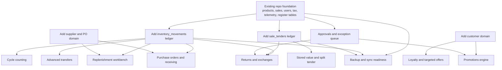
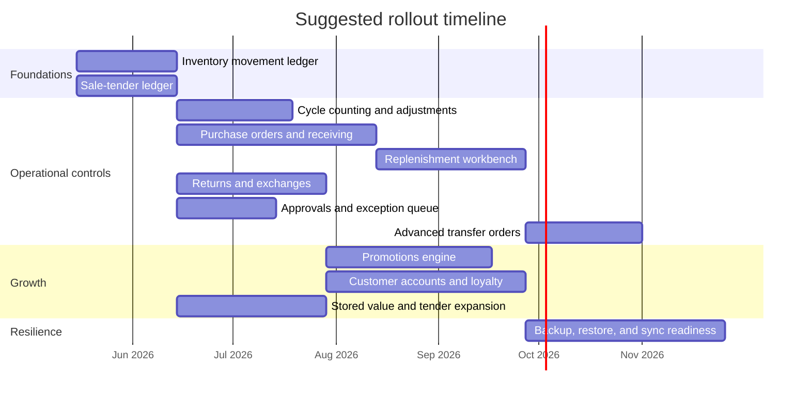

# Feasible Future Features for RetailStorePOS

## Executive Summary

I started with the enabled **GitHub connector** against **AbduarhmAN/RetailStorePOS-Microsoft** and then used higher-authority external sources to validate which future features are worth building next. The repository already provides a strong offline-first base: a WinUI desktop app plus a local SQLite data layer, one local `pos.db`, local `preferences.json`, and no extra worker/service-host project in the inspected modular-monolith inventory. The inspected bootstrap schema already includes `products`, `sales`, `sale_items`, `settings`, `telemetry_outbox`, `installation_events`, `users`, `sessions`, `audit_logs`, tax tables, `order_tax_overrides`, `tender_types`, `bundle_components`, `register_sessions`, and `register_cash_adjustments`. fileciteturn71file0 fileciteturn69file0

That current foundation makes **ten** future features especially feasible beyond premium reports: **cycle counting and stock adjustments; purchase orders, suppliers, and receiving; replenishment workbench; advanced transfer orders; returns, exchanges, and refund controls; manager approval workflow and exception queue; customer accounts with loyalty and targeted offers; promotion and price execution; stored value and tender expansion; and backup/restore with sync readiness**. These features matter because the strongest external evidence consistently points to four operational profit levers: reducing inventory record inaccuracy, preventing stockouts, using promotions more intelligently, and protecting continuity and operational control. Inventory record inaccuracy is materially common in retail data; stockouts harm purchase behavior and store choice; lead-time uncertainty degrades inventory performance; targeted promotions can improve retailer profit; returns and return abuse are economically large; and tested backups are a core resilience control. citeturn7search0turn7search2turn3search3turn3search6turn6search1turn5search0turn5search6turn4search0turn4search2

The most important repo-specific conclusion is architectural, not cosmetic: **many of the best future features depend on two missing cross-cutting ledgers**. In the inspected schema and sale flow, sales still persist a single `payment_type` on the sale header, and sale completion decrements `products.quantity_store` and `quantity` directly rather than writing a general inventory-movement ledger. I did **not** find customer, supplier, purchase-order, returns, sale-tender-allocation, or inventory-movement tables in the inspected bootstrap schema, so those remain the main prerequisites and are marked below as **requires schema confirmation** for full-repo completeness. fileciteturn69file0 fileciteturn70file0

The practical build order should therefore be: first, add the **inventory-movement** and **sale-tender** foundations; second, ship the highest-value operating controls built on top of them; third, add growth-oriented customer and promotion features; and fourth, harden resilience and sync. The app’s own privacy policy also helps define safe boundaries: operational business data is intended to remain local by default, and the app is **not** designed to store payment-card or cardholder data. fileciteturn72file0

## Repository Baseline and Info Needs

The repo inspection answered several key feasibility questions directly and narrowed the remaining unknowns. The table below lists the most important information needs for feature planning and the status reached from the connector-first review.

| Info need | What the repo currently shows | Status |
|---|---|---|
| What business tables already exist? | The inspected bootstrap schema defines `products`, `sales`, `sale_items`, `settings`, `telemetry_outbox`, `installation_events`, `users`, `sessions`, `audit_logs`, `tax_authorities`, `tax_rules`, `tax_groups`, `tax_group_rules`, `order_tax_overrides`, `tender_types`, `bundle_components`, `register_sessions`, and `register_cash_adjustments`. fileciteturn69file0 | Confirmed |
| How is inventory changed today? | `SaleRepository.CreateSale` writes a sale and then updates `products.quantity_store`, `quantity`, `last_sale_at`, and `updated_at` directly for each line item. fileciteturn70file0 | Confirmed |
| How are tenders stored today? | The inspected schema stores `sales.payment_type` on the sale header and seeds `tender_types` such as Cash and Card. I did not find a `sale_tenders` allocation table in the inspected bootstrap schema. fileciteturn69file0 fileciteturn70file0 | Header-only path confirmed; split-tender support **requires schema confirmation** |
| Does the app already have customer, supplier, purchase-order, return, or inventory-movement tables? | I did **not** find those tables in the inspected bootstrap schema. Because I did not inspect every possible branch or unpublished file, full absence from the whole codebase still **requires schema confirmation**. fileciteturn69file0 | Not found in inspected schema; **requires schema confirmation** |
| Is the app truly local/offline-first? | The modular inventory describes one WinUI executable, one data library, one normalized local `pos.db`, and local `preferences.json`; the privacy policy also states operational business data is generally stored locally and controlled by the merchant. fileciteturn71file0 fileciteturn72file0 | Confirmed |
| Is payment-card storage in scope? | The privacy policy explicitly says the app does not currently support storing payment-card or cardholder data. fileciteturn72file0 | Confirmed |

Two additional repo observations materially shape feature design. First, the schema already contains **staff auth and internal-control primitives** such as `users`, `sessions`, `audit_logs`, `order_tax_overrides`, and register sessions, which lowers the implementation cost of approval, exception, and cash-control features. Second, the modular inventory shows a clear two-project architecture and existing module boundaries for Products, Sales, Inventory, Tax, Reporting, Telemetry, and Settings, which favors **incremental extension** rather than a risky platform rewrite. fileciteturn69file0 fileciteturn71file0

## Research Basis and Evidence Hierarchy

For external evidence, I prioritized **academic papers, government and central-bank datasets, and primary official research pages** over marketecture. The strongest non-repo sources used here are the FTC on retailer-level scanner data for promotion analysis, the U.S. Census and FRED on retail inventories and inventories-to-sales ratios, CISA on data backup and recovery controls, the Federal Reserve on consumer payment behavior, and peer-reviewed or university-hosted summaries on inventory record inaccuracy, stockouts, lead-time uncertainty, transshipments, loyalty, and targeted promotions. citeturn3search0turn3search1turn3search5turn4search2turn9search0turn7search0turn7search2turn6search1turn6search0turn5search0turn5search6turn8search2turn8search4turn8search7

The evidence is strongest for inventory-control features. A Harvard Business School summary of DeHoratius and Raman reports that **65%** of nearly 370,000 inventory records in 37 stores were inaccurate, and cycle-counting research shows historical count data can be used to target the items most likely to be inaccurate. That makes cycle counting, replenishment, transfers, and receiving features more than “nice to have”; they address a directly evidenced retail control problem. citeturn7search0turn7search2

The evidence is also strong that stockouts matter financially. Consumer stockout research shows stockouts can lower satisfaction and increase future store switching, while revealed-behavior work finds stockouts change whether shoppers buy, how much they buy, and what they buy. Lead-time uncertainty further degrades supply-planning performance, which strengthens the case for purchase orders, receiving, and replenishment logic. citeturn3search3turn3search6turn6search1

Promotion and customer features have meaningful but more conditional evidence. FTC research shows retailer-level scanner data can answer important questions about the interaction of promotions. More recent promotional analytics research finds that customized promotions can generate positive per-customer returns and improve expected retailer profit, but offline individual-level gains are not always large, and redemption can be a practical bottleneck. Loyalty research supports retention and value effects in some settings, but program design matters, and “digital receipts alone” do not have comparably strong direct ROI evidence. citeturn3search0turn5search0turn5search6turn8search2turn8search4turn8search7

Returns, approvals, and resilience features rely on a mix of evidence types. Returns economics are well documented in NRF/Happy Returns industry research, which is useful for sizing the problem but should not be treated as peer-reviewed causal proof. Backup and restore readiness, by contrast, rests on authoritative security guidance: CISA explicitly recommends regular backups, recovery testing, offline/off-site copies, and recovery objectives. citeturn4search0turn4search1turn4search2

## Feature Portfolio

The most useful way to read the table below is to separate **foundation-operational features** from **growth features** and **resilience features**. The first group is where the strongest evidence and cleanest ROI logic live; the second group can be valuable but is more design-sensitive; the third group protects continuity more than it directly raises sales.

| Feature | What it does | Business value and evidence | Required data and schema fields | Algorithms or methods | UI/UX placement and visualization | Complexity and effort | Privacy and compliance | Rollout and pilot design |
|---|---|---|---|---|---|---|---|---|
| **Cycle counting and stock adjustments** | Creates scheduled or risk-based count sessions, captures counted quantity and reason codes, and posts stock adjustments. | Strong evidence base. Inventory record inaccuracy is common, and targeted cycle counting can use historical data to reduce counting effort while improving accuracy. citeturn7search0turn7search2 | Existing: `products`, `users`, `audit_logs`, stock thresholds. New: `stock_count_sessions`, `stock_count_lines`, `variance_reason_codes`, `stock_adjustments`, `inventory_movements` — **requires schema confirmation**. fileciteturn69file0 | Risk score using item value, velocity, prior variance, days since last count, and negative-stock history. | Inventory area with a daily count queue, barcode-first count screen, blind-count option, manager variance review, and reason-code picker. | **Medium**; good first operational feature once the inventory ledger exists. | Internal operational data only, but adjustments need durable audit trails and role checks. | Pilot on fast movers and high-margin SKUs. Compare variance rate, negative-stock incidents, false stockouts, and labor minutes per count before/after. |
| **Purchase orders, suppliers, and receiving** | Adds supplier master data, PO creation, ETA tracking, partial receiving, and cost updates. | Strong operational logic, moderate direct evidence. Lead-time uncertainty degrades performance, and inventory-to-sales is a standard stock-coverage lens. citeturn6search1turn3search1turn3search5 | Existing: product cost and stock fields. New: `suppliers`, `supplier_contacts`, `supplier_items`, `purchase_orders`, `purchase_order_lines`, `goods_receipts`, `goods_receipt_lines`, `on_order_qty`, `lead_time_days` — **requires schema confirmation**. fileciteturn69file0 | Reorder point, order-up-to logic, lead-time moving averages, receipt variance checks. | New Purchasing workspace with tabs for Suggested Orders, Open POs, Late POs, and Receiving. | **High**; new domain, forms, and state transitions. | Supplier contacts are business data; receiving changes should be audited; no card data involved. | Pilot in one category or supplier group. Track stockouts, emergency purchases, receipt timeliness, supplier fill rate, and margin impact. |
| **Replenishment workbench** | Converts stock and sales data into action cards such as reorder, transfer, wait, or review. | Strong evidence base because stockouts affect store choice and purchase behavior, while inaccurate records and uncertain lead times undermine replenishment quality. citeturn3search3turn3search6turn7search0turn6search1 | Existing: `products`, thresholds, sales history. New or extended: `inventory_movements`, `on_order_lines`, supplier lead times, review periods, service-level targets — **requires schema confirmation**. fileciteturn69file0 fileciteturn70file0 | Moving average or EWMA for regular demand; Croston-style logic for intermittent demand; lead-time demand and safety stock. | Inventory > Replenishment with ranked action list, confidence tags, forecast mini-charts, and one-click PO/transfer creation. | **Medium-High**. | Mostly operational data; manager actions should be logged for later backtesting. | Use matched categories or stores. Measure stockout rate, fill rate, days cover, emergency buys, and margin dollars. |
| **Advanced transfer orders** | Tracks requested, approved, shipped, received, and discrepant store/warehouse transfers. | Useful and evidence-backed, but evidence is more indirect for small retail stores than for distribution networks. Transshipments can improve turnover and fill rate, but the effect depends on timing and quantity. citeturn6search0turn6search4 | Existing: store/warehouse quantity fields. New: `transfer_orders`, `transfer_order_lines`, `transfer_status_events`, `inventory_movements`, possibly a broader `locations` model — **requires schema confirmation**. fileciteturn69file0 | Threshold-aware transfer recommendation, in-transit lifecycle, discrepancy capture, and source-protection rules. | Warehouse or Inventory > Transfers with kanban-style In Transit board and receive/reconcile screen. | **Medium**. | Low external privacy risk; internal fraud/error controls matter. | Pilot between one warehouse and one store or one store pair. Measure avoided stockouts, aged-stock reduction, transfer lead time, and discrepancy rate. |
| **Returns, exchanges, and refund controls** | Adds receipt-linked returns, exchanges, inspections, policy enforcement, and refund/store-credit routing. | Strong business case, but mainly from industry evidence. Retail returns were projected at $890 billion in 2024; return experience affects future shopping; abuse is a material concern. citeturn4search0turn4search1 | Existing: `sales`, `sale_items`, users, audit logs, and migration support for `sale_items.original_sale_item_id`. New: `returns`, `return_lines`, `return_reason_codes`, `return_inspections`, `refund_tenders`, `exchange_links`, `inventory_movements` — **requires schema confirmation**. fileciteturn69file0 | Policy rules, receipt matching, condition grading, high-risk/no-receipt flags, exchange vs refund logic. | Dedicated Returns desk with receipt search, line-level eligibility, condition review, and refund/store-credit outcome view. | **Medium-High**. | If later tied to customer accounts, privacy notices and retention rules matter; must not store cardholder data. fileciteturn72file0 | Pilot in categories with meaningful return volume. Track return handling time, exchange conversion rate, fraudulent-return write-offs, and return-related churn/complaints. |
| **Manager approval workflow and exception queue** | Routes risky actions such as no-receipt returns, large discounts, tax overrides, and cash adjustments to manager review. | Business logic is strong, but direct causal evidence is weaker. Retail shrink is financially material, yet software approval queues themselves are less studied than the underlying shrink problem. citeturn7search4 | Existing: `users`, `audit_logs`, `order_tax_overrides`, `register_sessions`, `register_cash_adjustments`. New: `approval_rules`, `approval_requests`, `approval_events`, `exception_cases` — **requires schema confirmation**. fileciteturn69file0 | Rule engine first; later peer-baseline anomaly scoring. | Cross-app exception inbox, manager PIN/reauth modal, daily exception digest. | **Medium**. | Strong least-privilege and audit requirements; every allow/deny should be logged. | Pilot with a narrow rule set first: large discount, cash-out, tax override, no-receipt return. Measure leakage reduction, false positives, and impact on checkout time. |
| **Customer accounts, loyalty, digital receipts, and targeted offers** | Adds identified customer profiles, opt-in consents, points/tiers, digital receipts, and targeted campaigns. | Useful but more context-dependent. Loyalty can influence retention and customer value, and targeted promotions can improve expected profit, but program design and redemption dynamics matter; digital receipts alone have weaker direct ROI evidence. citeturn8search2turn8search4turn8search7turn5search0turn5search6 | Existing: sales history only. New: `customers`, `customer_identifiers`, `customer_consents`, `loyalty_accounts`, `points_ledger`, `digital_receipts`, `offer_exposures`, `offer_redemptions`, `rfm_scores` — **requires schema confirmation**. | RFM scoring, category affinity, coupon targeting with holdouts, consent-aware communications. | Checkout customer-capture panel, customer profile page, loyalty wallet, campaign dashboard. | **High**. | Requires consent, retention controls, marketing-law review for email/SMS, and data-minimization defaults. | Run a randomized or matched-customer pilot. Measure opt-in rate, repeat rate, redemption, incremental margin vs holdout, and unsubscribe/complaint rate. |
| **Promotion and price execution engine** | Supports scheduled promos, bundles, coupons, price books, redemption tracking, and margin-floor checks. | Strong logic and good evidence when measured carefully. FTC work shows scanner data can support promotion analysis, and retailer-targeted promotion research finds positive profit effects under some designs. citeturn3search0turn5search0turn5search6 | Existing: `bundle_components`, sale lines, tax engine. New: `promotions`, `promotion_rules`, `promotion_targets`, `coupon_codes`, `redemptions`, `price_books`, `scheduled_price_changes` — **requires schema confirmation**. fileciteturn69file0 | Eligibility rules, stackability logic, price-floor checks, pre/post and holdout measurement, cannibalization review. | Pricing & Promotions calendar, rule builder, preview simulator, checkout “applied offers” strip. | **High**. | Truth-in-pricing and offer clarity matter; individualized offers require customer-consent governance. | Use SKU/store holdouts. Measure incremental gross margin, redemption, basket uplift, margin erosion, and category cannibalization. |
| **Stored value, gift cards, and tender expansion** | Adds store credit, gift cards, split tender, and multi-tender refunds. | Operationally useful, but direct profit evidence is weaker and more context-dependent. Federal Reserve payment research shows consumers use a mix of cash, cards, and prepaid instruments; the clearest immediate value here is checkout flexibility and exchange/store-credit support rather than guaranteed net new revenue. citeturn9search0turn9search2 | Existing: `sales.payment_type` and `tender_types`. New: `sale_tenders`, `stored_value_accounts`, `stored_value_ledger`, `gift_card_issuance`, `gift_card_redemptions`, `refund_tenders` — **requires schema confirmation**. fileciteturn69file0 fileciteturn70file0 | Ledger-based balance accounting, split-tender allocation, refund source tracking, optional expiry/escheatment rules. | Checkout tender sheet, issue/redeem gift card flow, customer wallet where applicable. | **Medium-High**. | The app policy already says cardholder data should not be stored; gift-card breakage, expiry, and escheatment rules vary by jurisdiction and require confirmation. fileciteturn72file0 | Pilot first with store credit and split tender before branded gift cards. Measure tender-completion rate, exchange-to-store-credit conversion, stored-value redemption, and cashier error rate. |
| **Backup, restore, and sync readiness** | Adds secure backups, restore testing, sync state, conflict handling, and recovery health indicators. | Strong resilience value, but mostly continuity rather than direct sales lift. CISA explicitly recommends regular backups, off-site copies, and tested recovery. citeturn4search2 | Existing: local `pos.db`, local preferences, telemetry outbox and installation events. New: `backup_jobs`, `backup_snapshots`, `restore_tests`, `device_registrations`, `sync_state`, `sync_conflicts` — **requires schema confirmation**. fileciteturn71file0 fileciteturn69file0 | Scheduled jobs, checksums, restore verification, conflict queues, RPO/RTO tracking. | Settings > Backup & Sync Health with last backup time, restore status, sync queue count, and conflict review. | **High**. | Encryption, role limits, backup retention, and off-device storage security matter. | Validate with restore drills and simulated outage tests. Measure RPO/RTO, restore success rate, sync conflict rate, and checkout continuity during degraded mode. |

The table above intentionally favors features that leverage the repository’s current strengths: local SQLite persistence, existing register and user controls, dual-zone stock fields, tax infrastructure, and modular domain separation. It also avoids overclaiming where evidence is thin. The strongest “build sooner” cases are still the inventory and operational-control features, because that is where both the repo and the literature line up most clearly. fileciteturn69file0 fileciteturn71file0 citeturn7search0turn7search2turn3search3turn6search1

## Technical Schema Mapping

A future-feature roadmap for this repository should not begin by adding random screens. It should begin by adding the minimal cross-cutting schema that lets multiple features share one reliable transaction model. In the current code, `SaleRepository` directly decrements inventory and stores only a header-level `payment_type`, so the most reusable data upgrade is an **inventory movement ledger** plus a **sale-tender ledger**. Without those, returns, transfers, receiving, split tender, store credit, and many advanced analytics features remain awkward or fragile. fileciteturn70file0

### Cross-cutting foundations

| Foundation item | Why it is needed | Depends on repo today | Suggested schema |
|---|---|---|---|
| **`inventory_movements` ledger** | Needed by receiving, sales, returns, transfers, cycle counts, and shrink/variance analysis | Today, sales decrement product stock directly rather than writing a reusable movement record. fileciteturn70file0 | `inventory_movements(id, product_id, location_id, movement_type, source_type, source_id, qty_delta, unit_cost_cents, occurred_at, created_by_user_id, reason_code)` |
| **`sale_tenders` ledger** | Needed by split tender, refund-to-original-tender, store credit, and accurate tender analytics | Today, tender is stored as one `sales.payment_type` string plus master `tender_types`. fileciteturn69file0 fileciteturn70file0 | `sale_tenders(id, sale_id, tender_type_id, amount_cents, reference_token, created_at)` |
| **Location abstraction** | Needed if transfers or multi-store depth expands beyond current store/warehouse fields | Current product stock supports `quantity_store` and `quantity_warehouse`, but not a general multi-location ledger. fileciteturn69file0 | `locations(id, code, name, type)` and location references in movement/transfer tables |
| **Customer master** | Needed for loyalty, digital receipts, targeted offers, and personalized returns policies | No inspected customer table in bootstrap schema. fileciteturn69file0 | `customers`, `customer_contacts`, `customer_consents`, `customer_identifiers` |
| **Supplier and purchasing domain** | Needed for PO, receiving, lead times, and replenishment-quality inputs | No inspected supplier or PO tables in bootstrap schema. fileciteturn69file0 | `suppliers`, `supplier_items`, `purchase_orders`, `goods_receipts` |

### Feature-to-schema mapping

| Feature | Existing repo assets | New or extended schema needed | Implementation note |
|---|---|---|---|
| Cycle counting | `products`, `users`, `audit_logs` fileciteturn69file0 | `stock_count_sessions`, `stock_count_lines`, `stock_adjustments`, `inventory_movements` | Build after movement ledger exists |
| Purchase orders and receiving | product cost, stock thresholds fileciteturn69file0 | `suppliers`, `supplier_items`, `purchase_orders`, `goods_receipts`, `inventory_movements` | Highest-value new domain after counting |
| Replenishment workbench | product stock fields and sales history fileciteturn69file0 fileciteturn70file0 | `forecast_snapshots`, `supplier lead_time_days`, `on_order_lines`, `inventory_movements` | Can start simple before ML |
| Transfer orders | `quantity_store`, `quantity_warehouse` fileciteturn69file0 | `transfer_orders`, `transfer_order_lines`, `inventory_movements`, possibly `locations` | Promote current store/warehouse model into explicit workflow |
| Returns and exchanges | `sales`, `sale_items`, `original_sale_item_id` precursor, audit logs fileciteturn69file0 | `returns`, `return_lines`, `refund_tenders`, `inventory_movements` | Use receipt-linked flows first |
| Approval workflow | users, audit logs, tax overrides, register tables fileciteturn69file0 | `approval_rules`, `approval_requests`, `exception_cases` | Mostly service/UI + light tables |
| Customer/loyalty/offers | sales only fileciteturn70file0 | `customers`, `loyalty_accounts`, `points_ledger`, `offer_exposures`, `offer_redemptions` | Net-new customer domain |
| Promotions | `bundle_components`, sale logic, tax layer fileciteturn69file0 | `promotions`, `promotion_rules`, `redemptions`, `price_books` | Tie measurement to sales and tenders |
| Stored value and tender expansion | `tender_types`, `sales.payment_type` fileciteturn69file0 fileciteturn70file0 | `sale_tenders`, `stored_value_accounts`, `stored_value_ledger` | Requires tender ledger first |
| Backup/restore/sync readiness | local `pos.db`, local prefs, telemetry outbox, installation events fileciteturn71file0 fileciteturn69file0 | `backup_jobs`, `backup_snapshots`, `restore_tests`, `sync_state`, `sync_conflicts` | Best after event and ledger models stabilize |

## Prioritized Roadmap

The roadmap below ranks features by business value, implementation complexity, current data availability, and practical ordering for a small WinUI + SQLite codebase. The effort labels are **repo-specific engineering estimates**, not externally benchmarked delivery guarantees; they reflect the current two-project architecture, local-first storage model, and the amount of new schema each feature needs. fileciteturn71file0

| Rank | Feature | Business value | Complexity | Current data availability | Recommended order |
|---|---|---:|---|---|---|
| 1 | Cycle counting and stock adjustments | Very high | Medium | Medium | First |
| 2 | Purchase orders, suppliers, and receiving | Very high | High | Low-Medium | Second |
| 3 | Replenishment workbench | Very high | Medium-High | Medium | Third |
| 4 | Returns, exchanges, and refund controls | High | Medium-High | Medium | Fourth |
| 5 | Manager approval workflow and exception queue | High | Medium | Medium-High | Fifth |
| 6 | Advanced transfer orders | Medium-High | Medium | Medium | Sixth |
| 7 | Promotion and price execution engine | High | High | Low-Medium | Seventh |
| 8 | Customer accounts, loyalty, digital receipts, and targeted offers | High | High | Low | Eighth |
| 9 | Stored value, gift cards, and tender expansion | Medium | Medium-High | Low-Medium | Ninth |
| 10 | Backup, restore, and sync readiness | Medium continuity value | High | Medium | Tenth |

The order above assumes two **unranked prerequisites** are completed first or in parallel: the inventory-movement ledger and the sale-tender ledger. Those are not user-facing roadmap items, but they sharply reduce rework across the rest of the plan. fileciteturn70file0

## Evidence Limits and Final Assessment

Some features in this report have **stronger evidence than others**, and that should shape delivery decisions. The strongest causal and operational support is behind **inventory accuracy**, **cycle counting**, **stockout prevention**, **lead-time-aware replenishment**, and **scanner-data-based promotion measurement**. Those are the features least dependent on optimistic assumptions. citeturn7search0turn7search2turn3search3turn3search6turn6search1turn3search0

A second tier has good business logic but more context dependence. **Transfers** are supported by both theory and empirical work, but some of the best empirical estimates come from distribution-center data rather than single-store SMB retail networks. **Loyalty** and **targeted offers** can help retention and profit, but the size of effect depends heavily on program design, category mix, redemption, and whether the business can capture customer identity cleanly. **Gift cards and split tender** are useful and often expected, but their direct revenue effect is weaker and much more context-dependent than the inventory-control features. citeturn6search0turn6search4turn8search2turn8search4turn8search7turn5search0turn5search6turn9search0turn9search2

The repository also places real constraints on scope. In the inspected bootstrap schema, I did **not** find customer, supplier, purchase-order, return, inventory-movement, or sale-tender tables. That does **not** prove those concepts are absent from every branch or every unpublished spec, but it does mean they were not present in the primary schema entry point I inspected, so they remain **requires schema confirmation** before final delivery estimates or migration sequencing are locked. fileciteturn69file0

The safest practical conclusion is therefore this: **build next where the repo and the evidence overlap most strongly**. For this codebase, that means starting with inventory-control and operational-control features, not with the most glamorous customer-marketing features. The app already has the local-first foundation, internal user controls, cash/register tables, tax infrastructure, and sales persistence to support that direction. The next stage should be a disciplined sequence of shared schema foundations followed by high-value operating workflows, with every feature validated through a controlled pilot using predeclared metrics rather than intuition alone. fileciteturn69file0 fileciteturn71file0 fileciteturn72file0