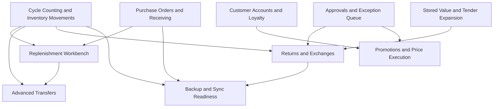
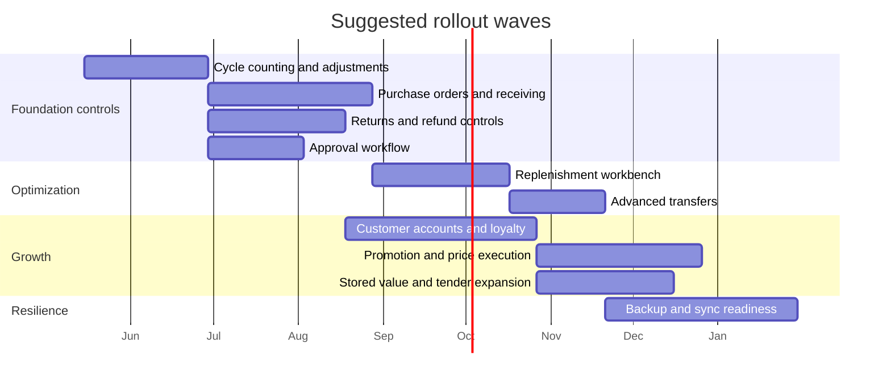

# Future Features Roadmap for RetailStorePOS

## Executive Summary

I started with the enabled **GitHub connector** and reviewed the repository **AbduarhmAN/RetailStorePOS-Microsoft**. The current app is already a meaningful offline-first retail/POS foundation: it uses a local SQLite database; supports products, sales, sale items, users, sessions, audit logs, tax authorities/rules/groups, tender types, bundle components, telemetry outbox, and installation events; and already has dual-zone inventory fields (`quantity_store`, `quantity_warehouse`) plus reorder thresholds (`min_threshold_store`, `min_threshold_warehouse`). The checkout flow supports barcode/name search, discount lines, receipt archiving, and low-stock alerts; the reports page already computes sales, tax, gross profit, cash/card totals, and product movers; and the app policy states that operational data is local and that payment card data is **not** currently stored. fileciteturn31file0 fileciteturn14file0 fileciteturn12file0 fileciteturn18file0 fileciteturn33file0 fileciteturn23file0 fileciteturn44file0

The most valuable future features beyond premium reports are the ones that turn existing data into **operational action** rather than only more visibility. On that basis, the best roadmap is: **cycle counting**, **purchase orders and receiving**, **returns/exchanges controls**, **manager approval workflows**, **replenishment workbench**, **advanced transfer orders**, **customer accounts with loyalty/digital receipts/targeted offers**, **promotion and price execution**, **stored value and tender expansion**, and **backup/sync readiness**. Inventory accuracy and stock availability have especially strong research support, because inventory record inaccuracy is common and is linked to stockouts and revenue loss; consumer stockouts also create lost-sale risk because many shoppers do not simply substitute or wait. citeturn0search5turn8view1turn8view2turn2search9

The clearest architecture gap is that the current schema appears **not** to define customer, supplier, purchase-order, return, sale-tender, or inventory-movement tables in the bootstrap schema I inspected, while sales currently decrement `products.quantity_store` directly during sale creation. That means the single most important cross-cutting upgrade is to add an **inventory movement ledger** and a **sale-tender ledger**, because several premium features depend on those structures. fileciteturn31file0 fileciteturn33file0

## Research Basis and Current Repo Baseline

The research stack for this report was deliberately tiered. **Primary and higher-authority sources** included the inspected GitHub repository, peer-reviewed journal abstracts and publisher pages, U.S. government sources such as the Census Bureau, Federal Reserve, FTC, and CISA, plus university research pages. **Industry evidence** was used only where operational retail topics are poorly covered by public official datasets, particularly returns and shrink. I did **not** use POS-platform marketing pages as source-of-truth evidence. That matters because the strongest claims in this report need to survive independent verification, especially where the feature case depends on profit, shrink, or consumer behavior. fileciteturn31file0 citeturn3search0turn5search0turn2search2turn6search2turn0search5turn8view1

A few repo findings are central to feasibility. The database bootstrap defines `products`, `sales`, `sale_items`, `users`, `sessions`, `audit_logs`, `tax_authorities`, `tax_rules`, `tax_groups`, `order_tax_overrides`, `tender_types`, `bundle_components`, `telemetry_outbox`, and `installation_events`, but I did not find customer, supplier, purchase-order, returns, or multi-tender allocation tables in the bootstrap schema reviewed. Products already carry cost, store and warehouse quantities, thresholds, and timestamps that are directly usable for replenishment and stock-control features. The sales repository already stores item cost and tax snapshots and computes dashboard metrics such as revenue, profit, discount amount, and top products. fileciteturn31file0 fileciteturn14file0 fileciteturn33file0

Two current implementation details strongly shape the roadmap. First, checkout currently persists a single `payment_type` and, in the inspected checkout flow, sets it to `"cash"` at sale completion, even though the schema already seeds `tender_types` for Cash and Card. That makes tender expansion feasible, but it also means split payments require a new ledger design rather than a small UI tweak. Second, the app has audit logging, role/permission flags, order tax override hooks, and background telemetry/outbox plumbing, which lowers the implementation cost of manager approvals, exceptions handling, and future backup/sync. fileciteturn12file0 fileciteturn31file0 fileciteturn23file0 fileciteturn25file0 fileciteturn41file0 fileciteturn42file0

The strongest external evidence cluster favors the inventory and pricing parts of the roadmap. Harvard Business School’s summary of DeHoratius and Raman reports that in one retailer dataset, **65%** of inventory records were inaccurate; a later peer-reviewed IJPE paper states that inventory record inaccuracy can create stockouts and revenue losses; and cycle-counting research shows historical data can be used to focus counts on items most likely to be inaccurate. FTC work also shows retailer-level scanner data can be used to answer important questions about how promotions interact, while more recent promotion analytics research finds customized targeting can improve expected retailer profit. citeturn0search5turn8view1turn8view2turn3search0turn9view1

## Feature Comparison

| Feature | What it does | Main value path | Evidence basis | Complexity | Repo leverage |
|---|---|---|---|---|---|
| Purchase orders, suppliers, and receiving | Adds supplier master data, PO creation, partial receiving, cost updates, and expected delivery tracking | Reduces stockouts, shortens reordering lag, improves cost visibility | Lead-time uncertainty materially degrades inventory performance; Census defines inventory/sales ratio as months of inventory on hand. citeturn5search2turn5search9turn5search0 | High | `products`, costs, dual-zone inventory, users, audit logs fileciteturn31file0 fileciteturn14file0 |
| Replenishment workbench | Converts sales/inventory data into reorder and transfer actions instead of only reports | Improves availability while limiting excess stock | IRI causes stockouts and revenue losses; many consumers faced with OOS do not simply switch or delay. citeturn8view1turn2search9 | Medium-High | Product quantities, thresholds, sales history, cost data already exist fileciteturn14file0 fileciteturn33file0 |
| Cycle counting and stock adjustments | Creates count sessions, variance capture, reason codes, and adjustment posting | Improves inventory accuracy and prevents false stock confidence | 65% inaccurate records in one large retailer sample; targeted cycle counting reduces effort. citeturn0search5turn8view2 | Medium | Quantity and threshold fields already exist, but no count ledger is visible in current bootstrap schema fileciteturn31file0 |
| Advanced transfer orders | Adds source/destination requests, in-transit status, receiving confirmation, and discrepancy handling | Rebalances stock, reduces lost sales, improves fulfillment | Transshipments reduce ordering and holding/backorder costs; empirical work has found gains in turnover and fill rate. citeturn4search6turn9view3 | Medium | Dual-zone inventory is already present fileciteturn14file0 |
| Returns, exchanges, and refund controls | Adds receipt-linked returns, exchange flows, condition checks, policy rules, and fraud flags | Shrink reduction, fewer abusive returns, better customer retention | NRF/Happy Returns estimates 2024 returns at $890B and 16.9% of annual sales; 93% of retailers report returns abuse/fraud as significant. Appriss estimates returns/claims fraud at $103B in 2024. citeturn9view6turn9view7turn0search2 | Medium-High | Sales, sale items, tax snapshots, audit logging, user permissions, and refund-link migration hooks exist fileciteturn31file0 fileciteturn23file0 |
| Customer accounts, loyalty, digital receipts, targeted offers | Captures identified customers, opt-ins, points, digital receipts, and personalized offers | Raises repeat visits, supports CLV, improves promotional targeting | Item-based loyalty programs can reduce attrition and attract new customers; customized targeting can raise expected profit; e-receipt nudges alone show only modest direct adoption effects. citeturn8view3turn9view1turn7search4 | High | Repo lacks visible customer tables, so this is a net-new domain on top of existing sales data fileciteturn31file0 |
| Promotion and price execution engine | Adds scheduled promos, coupons, bundles, price books, margin floors, and redemption tracking | Gives cleaner markdown execution and margin discipline | FTC scanner-data work shows retailer-level promotion interactions matter; targeted promotion research shows better targeting can improve profit. citeturn9view2turn9view1 | High | `bundle_components` already exists; checkout already supports discount line items fileciteturn31file0 fileciteturn12file0 |
| Approval workflow and exception queue | Routes risky actions for manager review and creates a daily exception inbox | Reduces leakage from overrides, refund abuse, and policy exceptions | Retail shrink averaged 1.6% of sales in NRF’s 2023 survey, but direct software-causal evidence for approval queues is weaker and more inferential. citeturn6search0 | Medium | `audit_logs`, permissions flags, and `order_tax_overrides` already exist fileciteturn31file0 fileciteturn23file0 fileciteturn25file0 |
| Stored value, gift cards, and tender expansion | Adds store credit, gift cards, and multi-tender support | Supports exchanges, prepaid spend, and payment flexibility | Fed diary data shows diverse and rising electronic payment use; gift card profitability is supported in research but depends heavily on margin and redemption behavior; evidence for split tender specifically is limited. citeturn9view4turn9view5turn1search5 | Medium-High | `tender_types` exists, but current checkout stores one tender string and policy says no cardholder data storage today fileciteturn31file0 fileciteturn12file0 fileciteturn44file0 |
| Backup, restore, and cloud-sync readiness | Adds secure backups, restore flow, sync health, and eventually multi-device support | Lowers outage/data-loss risk rather than directly raising revenue | CISA explicitly recommends regular backups and recovery testing for business continuity; direct revenue uplift evidence is weak/context-dependent. citeturn6search2 | High | `telemetry_outbox`, installation events, and background sync startup already exist fileciteturn31file0 fileciteturn41file0 fileciteturn42file0 |

## Detailed Feature Designs

Before feature-by-feature details, one implementation point is worth making explicitly: the current design appears to update product stock directly during sale creation rather than writing an inventory movement ledger, and it stores a single sale-level payment type rather than a tender allocation ledger. Those two choices are workable for the current product, but they become bottlenecks for purchase receiving, transfers, cycle counts, returns, multi-tender, stored value, and sync. I would treat **`inventory_movements`** and **`sale_tenders`** as foundational platform additions. fileciteturn33file0 fileciteturn31file0

| Feature | Existing schema/app assets you can reuse | New tables/fields to add | Notes |
|---|---|---|---|
| Purchase orders and receiving | `products`, `users`, `audit_logs`, `settings` fileciteturn31file0 | `suppliers`, `supplier_contacts`, `supplier_items`, `purchase_orders`, `purchase_order_lines`, `goods_receipts`, `goods_receipt_lines`, `inventory_movements` | `lead_time_days`, `moq_qty`, `case_pack_qty`, `payment_terms_days`, `freight_cents` all **require schema confirmation** |
| Replenishment workbench | `sales`, `sale_items`, `products`, thresholds, costs fileciteturn14file0 fileciteturn33file0 | `forecast_snapshots`, `replenishment_recommendations`, `inventory_movements`, `on_order_lines` | `service_level_target`, `review_period_days`, `seasonality_profile` **require schema confirmation** |
| Cycle counting | `products`, `users`, `audit_logs` fileciteturn31file0 | `stock_count_sessions`, `stock_count_lines`, `variance_reason_codes`, `stock_adjustments`, `inventory_movements` | `count_device_id` and `blind_count_flag` **require schema confirmation** |
| Advanced transfers | Dual-zone quantities in `products` fileciteturn14file0 | `transfer_orders`, `transfer_order_lines`, `transfer_status_events`, `inventory_movements`, `locations` if multi-store emerges | `source_location_id` and `destination_location_id` beyond store/warehouse **require schema confirmation** |
| Returns and exchanges | `sales`, `sale_items`, `users`, `audit_logs`, refund-link hook in migration path fileciteturn31file0 fileciteturn23file0 | `returns`, `return_lines`, `return_reason_codes`, `return_inspections`, `refund_tenders`, `exchange_sales_link`, `inventory_movements` | `original_sale_item_id` handling must be standardized across full and partial returns |
| Customer accounts / loyalty / digital receipts | Existing sales history only fileciteturn33file0 | `customers`, `customer_identifiers`, `customer_consents`, `loyalty_accounts`, `points_ledger`, `customer_sales`, `digital_receipts`, `offer_exposures`, `offer_redemptions`, `rfm_scores` | Email/SMS provider integration and retention fields **require schema confirmation** |
| Promotions and price execution | `bundle_components`, discount line items, tax engine fileciteturn31file0 fileciteturn12file0 | `promotions`, `promotion_rules`, `promotion_targets`, `coupon_codes`, `redemptions`, `price_books`, `scheduled_price_changes`, `promotion_funding` | Vendor-funding and co-op fields **require schema confirmation** |
| Approvals and exceptions | `users`, permission flags, `audit_logs`, `order_tax_overrides` fileciteturn31file0 fileciteturn25file0 | `approval_rules`, `approval_requests`, `approval_events`, `exception_cases`, `exception_reason_codes` | PIN re-auth at action time should be required for sensitive approvals |
| Stored value / gift cards / tender expansion | `tender_types`, current `sales.payment_type` header, policy boundary on card data fileciteturn31file0 fileciteturn44file0 | `sale_tenders`, `stored_value_accounts`, `stored_value_ledger`, `gift_card_issuance`, `gift_card_redemptions`, `refund_tenders` | Escheatment/expiry/legal settings **require schema confirmation** |
| Backup / restore / sync | `telemetry_outbox`, `installation_events`, background sync startup fileciteturn41file0 fileciteturn42file0 | `backup_jobs`, `backup_snapshots`, `device_registrations`, `sync_state`, `sync_conflicts`, `encryption_keys_metadata` | Data residency, cloud region, and key management **require schema confirmation** |

**Purchase orders, suppliers, and receiving** should be the first major operating workflow after inventory accuracy work. The feature should create supplier records, supplier-item attributes, open POs, expected receipt dates, partial receipts, and cost postings. The financially important decisions are supplier choice, order timing, and order quantity. The minimum useful algorithms are reorder point, order-up-to level, and supplier lead-time tracking; EOQ can stay optional. The best UI is a **Purchasing workspace** with “Suggested order,” “Open POs,” and “Late receipts” tabs plus a receiving screen that posts accepted, short, and damaged quantities. Pilot this in one category and measure stockouts, emergency orders, average days-on-hand, and realized gross margin before wider rollout. Evidence for exact uplift is context-dependent, but the causal logic from stock availability and lead-time control is strong. citeturn5search2turn5search9turn5search0turn2search9 fileciteturn14file0 fileciteturn31file0

**Replenishment workbench** is the action layer that should sit on top of reports. Instead of showing only low-stock lists, it should produce ranked actions such as “Order 24 units from Supplier A,” “Transfer 6 units from warehouse,” or “Do not reorder yet because demand is intermittent.” The core methods should be simple and robust: moving averages or exponentially weighted demand for regular items, Croston-style logic for intermittent items, lead-time demand plus safety stock, and optional transfer recommendations when store stock is low but warehouse stock is above threshold. Put it in the Inventory area, not the Reports area, with action cards, confidence labels, and one-click PO/transfer creation. Validate through a controlled pilot on matched categories and compare stockouts, inventory-to-sales ratio, and margin dollars. citeturn8view1turn2search9turn5search0turn4search6 fileciteturn14file0 fileciteturn33file0

**Cycle counting and stock adjustments** should be treated as an operational control feature, not just an audit feature. The system should automatically create count tasks using a risk score that combines sales velocity, gross margin, variance history, and days since last verified count. Users then perform counts, enter reason codes for mismatches, and post adjustments into an inventory movement ledger. The right UX is a count queue with barcode scan input, blind count mode, and a variance review panel for managers. This feature has unusually strong evidence because inventory record inaccuracy is not a niche problem, and targeted cycle counting exists precisely because counting everything is too expensive. Pilot it first on fast movers and high-margin items, where false availability does the most damage. citeturn0search5turn8view1turn8view2 fileciteturn14file0 fileciteturn31file0

**Advanced transfer orders** should upgrade today’s dual-zone stock model into a tracked workflow: request, approve if needed, ship, receive, reconcile discrepancy, and close. The immediate business value is better service without overbuying. The decision rule can stay simple at first: only recommend a transfer if the source still remains above its own threshold after shipping and the destination would otherwise breach service expectations. Put it in the Inventory or Warehouse area with an in-transit board and line-level discrepancy capture. Measure success on avoided stockouts, transfer cycle time, and aged stock reduction. The external evidence supports transshipment as a cost and fulfillment tool, but exact gains will vary with distance, margin, and labor cost. citeturn4search6turn9view3 fileciteturn14file0 fileciteturn31file0

**Returns, exchanges, and refund controls** should become a first-class workflow because returns are economically large and fraud-sensitive. The feature should support receipt lookup, item-level eligibility, condition grading, exchange-versus-refund choice, restocking rules where legal, manager approval when risk thresholds are triggered, and stock routing back to shelf, warehouse, or quarantine. The UI should be a dedicated Returns desk with barcode/receipt search, side-by-side original transaction view, and refund tender routing. The repo already has the right building blocks for an audit trail, user identity, and sale-item lineage hooks, so feasibility is good. Pilot on a limited set of categories and compare fraudulent return write-offs, return processing time, and exchange conversion rate. citeturn9view6turn9view7turn0search2 fileciteturn31file0 fileciteturn23file0

**Customer accounts, loyalty, digital receipts, and targeted offers** should be implemented as one integrated domain rather than four separate features. The customer profile should store basic identifiers, opt-in status, receipt preference, and purchase history; loyalty should provide points or tiering; digital receipts should create an identification moment at checkout; and targeted offers should leverage simple RFM or category-propensity logic plus holdout testing. The key privacy requirement is explicit consent and easy opt-out for marketing. The key evidence point is that loyalty and targeted offers can influence retention and revenue, but results depend heavily on design and category; a digital receipt by itself should not be oversold as a revenue feature. Put the UX in checkout, customer profile, and a manager-facing campaigns view. citeturn8view3turn9view1turn7search4 fileciteturn31file0 fileciteturn44file0

**Promotion and price execution engine** should cover scheduled markdowns, bundles, order/cart rules, coupon codes, margin-floor protection, and redemption tracking. The repo already has `bundle_components` and a checkout path that can inject discount line items, so there is a real implementation foothold. The reason this is more than a “promo toggle” is that price and promotion execution fail when rules, stock, and measurement are disconnected. The app should therefore include a preview simulator showing expected receipt impact, tax behavior, and whether the promotion breaches configured margin floors. Put it in a Promotions calendar plus an at-checkout “applied offers” summary. Validate using holdouts or matched-SKU tests and focus on **incremental gross margin**, not just unit sales. citeturn9view2turn9view1 fileciteturn31file0 fileciteturn12file0

**Approval workflow and exception queue** is a pragmatic loss-control layer. It should cover price overrides, unusually large discounts, returns without receipt, tax overrides, voids after payment, no-sale drawer openings if those are added later, and post-close edits. The repo already has user permissions, sessions, audit logs, and a specific `order_tax_overrides` table that even documents a two-person authorization chain, so the architecture is aligned. The evidence case here is strongest as internal-control logic plus retail shrink context, not as a guaranteed-money feature. That means rollout should be explicitly measured: approval frequency, unauthorized override leakage, manager response time, and false positives that slow down checkout. Place the UX as a manager PIN modal plus a daily exception inbox. citeturn6search0 fileciteturn31file0 fileciteturn23file0 fileciteturn25file0

**Stored value, gift cards, and tender expansion** should be treated as a ledger project, not a UI-only enhancement. The app already knows about tender types, but current checkout persists only one sale-level payment type and currently hardcodes `"cash"` in the inspected flow. A robust implementation therefore needs `sale_tenders` and a stored-value ledger. The most defensible business case is for store credit and gift cards, which help exchanges stay in-store and can be profitable under the right conditions; the case for split tender as a revenue driver is weaker, though it still improves practical acceptance and customer convenience. Place it in the checkout tender sheet and customer profile area where relevant. Keep cardholder data out of scope unless you add an external payment processor integration. citeturn9view4turn9view5turn1search5 fileciteturn31file0 fileciteturn12file0 fileciteturn44file0

**Backup, restore, and cloud-sync readiness** is more about business continuity than direct commercial lift, but for an offline-first local-data POS it is still strategically important. CISA explicitly recommends regular backups and recovery testing, and the repo already contains a telemetry outbox plus background sync startup, which means there is a natural path toward sync-safe infrastructure. The correct approach is conservative: immutable sales events, careful conflict handling, visible sync status, encrypted backups, and routine restore drills. Put it in Settings with “last backup,” “restore test status,” and “sync health” indicators. Validate with operational KPIs such as recovery time objective, restore success rate, and sync conflict rate rather than revenue metrics. citeturn6search2 fileciteturn41file0 fileciteturn42file0 fileciteturn44file0

## Roadmap and Dependencies

The ranking below emphasizes **SMB usefulness**, **time-to-value**, **current data availability**, and **dependency order**. Effort labels are planning estimates derived from the repo’s current local-first WinUI + SQLite architecture, not externally sourced benchmarks.

| Rank | Feature | Business value | Complexity | Data availability today | Recommended order |
|---|---|---:|---|---|---|
| 1 | Cycle counting and stock adjustments | Very high | Medium | Medium | Build first |
| 2 | Purchase orders, suppliers, and receiving | Very high | High | Low-Medium | Build second |
| 3 | Returns, exchanges, and refund controls | High | Medium-High | Medium | Build third |
| 4 | Approval workflow and exception queue | High | Medium | Medium-High | Build fourth |
| 5 | Replenishment workbench | High | Medium-High | Medium | Build after PO + count foundation |
| 6 | Advanced transfer orders | Medium-High | Medium | Medium | Build after replenishment basics |
| 7 | Customer accounts, loyalty, digital receipts, targeted offers | High | High | Low | Build after operational controls stabilize |
| 8 | Promotion and price execution engine | High | High | Low-Medium | Build after customer + inventory foundations |
| 9 | Stored value, gift cards, and tender expansion | Medium | Medium-High | Low-Medium | Build after tender ledger is ready |
| 10 | Backup, restore, and cloud-sync readiness | Medium operational value | High | Medium | Build once financial/event schemas stabilize |

## Evidence Limits and Open Questions

The strongest evidence in this report supports **inventory accuracy**, **cycle counting**, **stockout prevention**, **transshipment logic**, and **targeted promotion economics**. Those areas have academic and official-source backing. The evidence is weaker or more context-dependent for **approval queues**, **backup/sync as a profit feature**, **digital receipts alone**, and **split tender as a direct sales driver**. For those items, the recommendation is still reasonable, but the value case should be treated as operationally plausible rather than universally proven. citeturn0search5turn8view1turn8view2turn9view1turn9view3turn6search2turn7search4

Industry evidence on returns and shrink is useful but should be interpreted carefully. NRF and Appriss provide some of the most cited public retail estimates for returns and shrink, but those are industry-survey-style sources rather than official government loss ledgers or peer-reviewed causal studies. They are appropriate for sizing the business problem, not for promising a guaranteed ROI from any single software feature. citeturn9view6turn9view7turn0search2turn6search0

The biggest repo-specific unknown is schema completeness outside the files I inspected. I reviewed the database bootstrap and several core application files, but not every branch or every historical spec. So wherever this report marks missing entities as **requires schema confirmation**, that is deliberate. The highest-priority schema questions before final scoping are: whether there is already any hidden inventory movement ledger; whether current transfer logic exists beyond the dual-zone product model; how receipt reprints and refunds are handled operationally today; and whether any cloud database or auth path beyond the local SQLite flow is already intended for production use. fileciteturn31file0 fileciteturn33file0 fileciteturn42file0

The final practical rule is simple: do not launch any “revenue” feature without a pilot design. For this codebase, each feature should ship behind a feature flag, run in one or two stores or one defined category first, and be judged on pre-registered metrics such as stockout rate, inventory variance, exchange retention, override leakage, incremental gross margin, or restore success. That is especially important because several of the strongest academic results come from grocery, fashion, or large retail datasets, and their magnitude may not transfer directly to every small or midsize merchant. citeturn8view3turn9view1turn8view1turn8view2