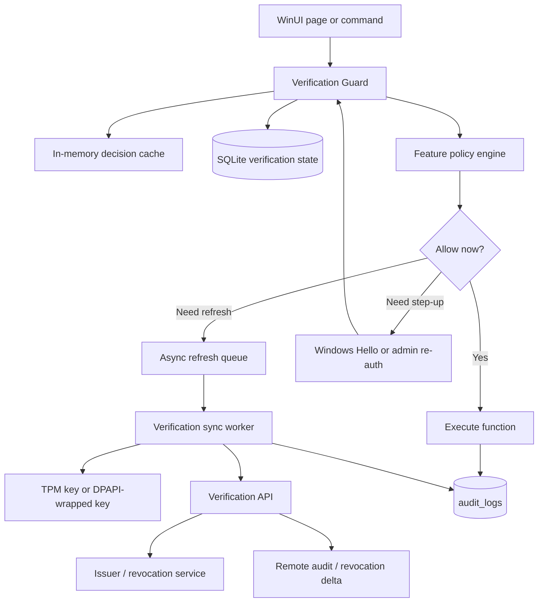
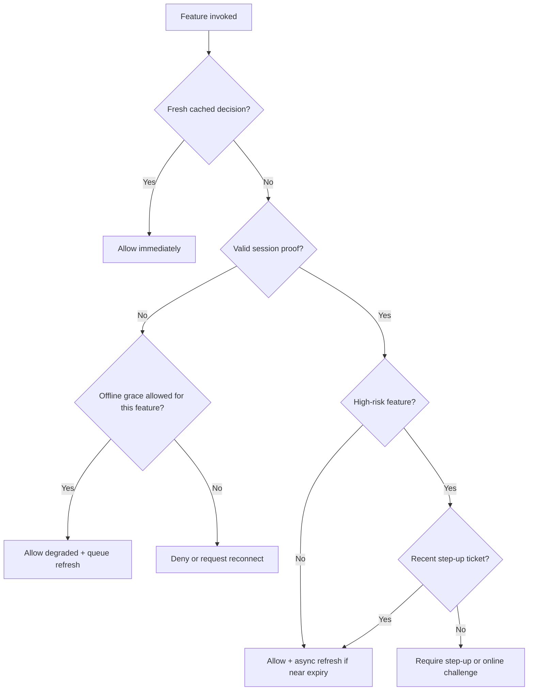

# Lightweight Hierarchical Verification Design for RetailStorePOS-Microsoft

## Executive summary

The best fit for **RetailStorePOS-Microsoft** is a **hybrid, locally-verifiable “pyramid certification” design** rather than a network-only gate. In practice, that means: a long-lived **issuer-signed installation certificate** that the client can verify offline, a short-lived **session proof** refreshed online when available, and very fast **per-feature authorization decisions** from memory/SQLite caches, with revocation and audit updates handled asynchronously in the background. That architecture matches the repo’s current shape: a WinUI desktop app plus a local SQLite data library, an offline-first startup path, local JSON preferences, DPAPI-protected secrets, and an existing async outbox/background-sync pattern for telemetry. fileciteturn6file0 fileciteturn31file0 fileciteturn32file0 fileciteturn5file0 fileciteturn30file0 fileciteturn12file0 fileciteturn24file0

The repository already contains several useful building blocks that should be reused rather than replaced: a normalized local-disk database boundary, WAL-enabled SQLite connections, DPAPI-backed secret storage, an optional background HTTP sync loop with retry/backoff, and a time-validation service that already checks for clock rollback against durable local timestamps. Those patterns are exactly what a non-blocking verification subsystem needs for fast local checks, stale-while-revalidate refresh, and anti-replay/anti-time rollback defenses. fileciteturn33file0 fileciteturn5file0 fileciteturn16file0 fileciteturn10file0 fileciteturn12file0 fileciteturn21file0

There are also two immediate security blockers that should be fixed in the same project, because they materially weaken any new verification layer. First, the app currently bootstraps a first admin with hard-coded credentials `admin / 1234 / 1234`. Second, password/PIN hashing uses PBKDF2-HMAC-SHA-256 with **10,000 iterations** and still accepts a legacy unsalted SHA-256 fallback, while current OWASP guidance recommends Argon2id where available, or PBKDF2-HMAC-SHA-256 with **600,000+ iterations** when PBKDF2 is used. fileciteturn19file0 fileciteturn14file0 citeturn1search1

The final recommendation is therefore:

1. **Implement a new Verification module** that follows the repo’s existing contract/workflow pattern.
2. **Use asymmetric signatures for offline install certificates** and **short-lived sender-constrained session proofs** for online renewal.
3. **Protect the client proof key with TPM/CNG when available, DPAPI as fallback**.
4. **Run per-feature verification locally** with memory cache first, SQLite second, network never on the hot path.
5. **Reserve online enforcement and step-up verification** for high-risk actions such as user administration, tax overrides, register close, and destructive settings changes.
6. **Treat hardware attestation as an optional higher-assurance tier**, not the minimum baseline. fileciteturn37file0 fileciteturn38file0 fileciteturn39file0 citeturn13search0turn13search3turn2search1turn10search0turn10search2turn15search1turn4search3turn1search0

## What the current repository already implies

RetailStorePOS-Microsoft is a **single-machine desktop POS** with one WinUI executable and one data library, with one local `pos.db` under app data and one local `preferences.json` file. Its own inventory explicitly describes the app as a **modular monolith** with local SQLite, local preferences, and no extra worker/service host project. That matters because the best verification design for this app is one that assumes **local execution is the primary path** and **network is an enhancement**, not the other way around. fileciteturn6file0 fileciteturn31file0 fileciteturn32file0 fileciteturn33file0 fileciteturn30file0

The repo also already demonstrates the right operational patterns for a lightweight verifier. `TelemetryService` uses a bounded `HttpClient`, a `SemaphoreSlim`, a periodic background sync loop, exponential backoff, an outbox table, and immediate local writes with later remote flush. `MainWindow` deliberately moves heavy runtime initialization off the UI thread so the splash screen and first-login path do not block the interface. A verification subsystem should behave the same way: write critical state locally and let remote validation/revocation refresh happen in the background. fileciteturn12file0 fileciteturn10file0 fileciteturn18file0

The contract model in the repo is also useful. The codebase already formalizes `ModuleContract`, `OwnedDataAsset`, and `WorkflowBoundary`, and it already has platform contracts for migrations, telemetry, and sync. That means the cleanest implementation is **not** to scatter verification logic across UI pages. It is to add a first-class `VerificationPlatformContract` plus one or more owned verification data assets and explicit command/query boundaries. fileciteturn37file0 fileciteturn38file0 fileciteturn39file0 fileciteturn23file0 fileciteturn24file0 fileciteturn25file0

The repo does, however, expose some risks that argue strongly for service-layer enforcement rather than UI-only checks. `AuthService` manages the current session mostly in memory, while the schema also contains a `sessions` table that is not part of a strong verification boundary today. `MainWindow.xaml.cs` directly invokes register close and cash-in/out operations. `ReadinessService` constructs `CheckoutViewModel` with repositories and services directly, which is a sign that business actions can be reached through multiple UI or test paths. A verification hook attached only to page buttons would therefore be too weak; the hook needs to sit at or below the command/service boundary used by those flows. fileciteturn8file0 fileciteturn13file0 fileciteturn18file0 fileciteturn35file0

One more design constraint is worth saying plainly: on a user-controlled endpoint, **software-only offline verification can raise the cost of tampering, but it cannot make local bypass mathematically impossible**. That is consistent with both the uploaded offline-licensing notes and with Microsoft’s documentation on why TPM-backed keys and attestation are stronger than software-only protection. The right goal here is therefore not “uncrackable local verification”; it is “cheap local checks for normal operation, strong device-bound proofs when possible, and server-side authority for revocation and high-value decisions.” fileciteturn0file1 citeturn15search1turn4search3turn16search0

## Candidate designs and which one wins

The comparison below is a **qualitative design estimate** for this repository, not a benchmark. It is based on the repo’s offline-first local architecture and on the relevant IETF/Microsoft/OWASP sources for JWS/JWT, HMAC, TLS 1.3, mTLS, proof-of-possession, revocation, TPM-backed keys, and selective disclosure. fileciteturn6file0 fileciteturn12file0 citeturn13search0turn13search3turn2search0turn2search1turn12search0turn0search0turn10search0turn10search2turn15search1turn4search0turn6search3

| Option | Core idea | Hot-path latency | CPU / memory cost | Network / data cost | Offline fit | Security level | Implementation effort | Fit for this repo |
|---|---|---:|---|---|---|---|---|---|
| **Hybrid signed capability pyramid** | Issuer-signed install certificate + short-lived sender-constrained session proof + local feature-policy cache | **Low** | **Low** | **Low** on steady state | **Excellent** | **High** when combined with revocation + step-up + device-bound key | **Medium** | **Best** |
| **mTLS-first enforcement** | Client cert on every protected remote request, token/cert binding at TLS layer | Medium to high | Medium | Medium to high | Poor unless all actions are online | High | High | Poor as primary model, useful as optional transport hardening |
| **TPM / measured-boot attestation gate** | Device proves boot state and key protection before getting authorization | Medium | Low to medium on client, higher operational complexity overall | Medium | Fair if cached, poor as hard online dependency | Very high on supported devices | High | Strong optional tier, not best baseline |
| **SD-JWT / selective-disclosure credentials** | Signed claims with selective disclosure and key binding | Low to medium | Low | Low | Good | High, but focused on claim minimization rather than POS feature gating | High | Overkill for current needs |

### Why the hybrid pyramid wins

A plain JWT/JWS gives a compact, locally-verifiable signed container; JWS is explicitly designed to provide integrity protection for arbitrary payloads, and JWT BCP exists because secure deployments need careful algorithm and validation choices. HMAC is efficient and specifically designed to preserve the performance profile of the underlying hash. DPoP and mTLS both exist to make tokens **sender-constrained** rather than bearer-only, reducing replay risk. Combining those ideas produces the right balance for an offline-capable POS: the app verifies a signed install entitlement locally, refreshes short-lived session state when online, and never needs a network roundtrip for normal per-feature checks. citeturn13search0turn13search3turn2search0turn2search1turn0search0

An mTLS-first design is strong, and RFC 8705 is clear that certificate-bound tokens prevent a stolen token from being used by a different client that lacks the private key. TLS 1.3 also provides confidentiality, integrity, and authenticated channels. The problem is fit: this repo is built for local operation, and mTLS becomes awkward if every important decision now needs an online protected resource. It is better as an **optional hardening of the refresh channel** than as the only authorization mechanism. citeturn0search0turn12search0turn14search0turn14search6

Hardware-backed attestation is the strongest answer to spoofing and tamper-resistance. Microsoft documents that TPM-backed keys can be created as non-exportable and that measured boot / health attestation can produce signed evidence of the platform’s boot state. NIST also treats public-key, replay-resistant, phishing-resistant authenticators with non-exportable keys as the stronger end of the assurance spectrum. The reason this is not the baseline recommendation is operational cost and platform dependency: it is excellent for a premium or enterprise tier, but too heavy as the only path for a retail desktop app that must keep working on ordinary Windows installs. citeturn15search1turn4search0turn4search3turn16search0turn16search1turn1search0

Selective-disclosure JWTs are interesting, but they solve a different primary problem: minimizing which claims are revealed to a verifier. The current SD-JWT specification is still an IETF draft, and the repo’s needs are feature gating, tamper-resistance, revocation, and non-blocking local verification, not privacy-preserving claim sharing between many external verifiers. It is a future option, not the right first implementation. citeturn6search3

## Recommended pyramid certification architecture

### The pyramid itself

For this app, “pyramid certification” should be implemented as **hierarchical trust levels** with tighter checks only where they matter:

- **Base layer — device proof key**: one per-install asymmetric key pair. Store the private key in **TPM/CNG Platform Crypto Provider** when available; otherwise store a DPAPI-wrapped software key.
- **Layer above — install certificate**: server-issued, issuer-signed, long-lived entitlement for the device/install. Contains install ID, customer/license tier, enabled feature scopes, allowed offline grace, and minimum revocation epoch.
- **Layer above — session proof**: short-lived, sender-constrained state obtained online when possible. Tied to the device proof key and optionally user identity.
- **Apex layer — high-risk step-up ticket**: a very short-lived approval used only for dangerous actions such as user management, tax overrides, register close, or destructive settings changes. Back it with Windows Hello / TPM-backed user gesture or, if that is not available, a separately rate-limited admin re-authentication flow. citeturn12search0turn2search1turn10search0turn10search2turn4search0turn4search3turn1search0turn11search3

### Architecture flowchart



The key idea in that flow is that the **UI never waits on the network on the hot path**. The guard first checks memory, then SQLite, then policy. A stale entry can schedule a refresh in the background while still allowing lower-risk work inside a bounded offline grace period. That follows the same design philosophy already present in the telemetry outbox and the startup bootstrap. fileciteturn10file0 fileciteturn12file0 fileciteturn18file0

### Decision flowchart



### State, storage, and activation toggle

A clean implementation should add a `Verification` module with small local tables such as:

| Proposed table | Purpose |
|---|---|
| `verification_installation` | current install certificate, issuer key id, serial, expiry, device-key fingerprint |
| `verification_session_state` | current short-lived session proof, user binding, expiry, last refresh |
| `verification_feature_cache` | per-feature decision cache with stale/fresh timestamps |
| `verification_revocation_state` | last revocation epoch, ETag/version, last sync time, offline grace limit |
| `verification_nonce_log` | recent challenge nonces / counters to reject replay |
| `verification_rate_limit` | local token-bucket state for login, unlock, and high-risk feature attempts |

That data model is intentionally small and operational-state oriented, matching the repo’s existing use of SQLite for telemetry runtime state, outbox, installation events, settings, and audit logs. fileciteturn7file0 fileciteturn8file0 fileciteturn9file0 fileciteturn10file0 fileciteturn11file0 fileciteturn29file0

A practical activation block can look like this:

```json
{
  "Verification": {
    "Enabled": true,
    "Mode": "Enforced",
    "AttestationMode": "Optional",
    "RequireOnlineForHighRisk": true,
    "SessionTtlMinutes": 10,
    "StepUpTtlSeconds": 90,
    "RevocationPollMinutes": 15,
    "OfflineGraceHours": 72
  }
}
```

For this repo, store these settings in the existing `settings` table instead of only in local JSON, because the repo already uses SQLite as the durable source for operational state and has owner paths for settings writes. fileciteturn9file0 fileciteturn6file0

### Issuance, renewal, revocation, and audit lifecycle

Use a simple lifecycle:

- **Issue**: the server signs an install certificate after registration/activation.
- **Renew**: the client refreshes certificate or session proof on login, unlock, network restore, and near-expiry.
- **Revoke**: the server publishes a small revocation delta or epoch. The client refreshes it in the background and applies it locally.
- **Audit**: local decisions are appended to `audit_logs` immediately; remote summaries can piggyback on the existing async outbox pattern, but remote audit must never block feature execution. fileciteturn29file0 fileciteturn27file0 fileciteturn10file0 fileciteturn12file0 citeturn10search0turn10search2

## Core algorithms and pseudocode

The pseudocode below is intentionally detailed enough to implement, but it avoids production-specific ceremony.

### Server-side issuance and refresh

```text
function IssueInstallCertificate(request):
    assert request.install_id is not empty
    assert request.device_public_key is valid
    assert request.customer_id is active
    assert requested_features subset_of customer_entitlements

    cert_payload = {
        version: 1,
        serial: new_serial(),
        install_id: request.install_id,
        customer_id: request.customer_id,
        device_key_thumbprint: sha256(request.device_public_key),
        features: request.features,
        risk_profile: request.risk_profile,
        issued_at: now_utc(),
        not_before: now_utc() - small_clock_skew,
        not_after: now_utc() + certificate_lifetime,
        min_revocation_epoch: current_revocation_epoch(),
        offline_grace_hours: policy.offline_grace_hours,
        attestation_required: policy.attestation_required
    }

    signed_certificate = JWS.sign(cert_payload, issuer_private_key)
    return signed_certificate
```

```text
function RefreshSessionProof(request):
    verify_install_certificate(request.install_certificate)
    assert not revoked(request.install_certificate.serial)

    challenge_ok =
        verify_device_signature_or_dpop(
            request.challenge,
            request.device_public_key,
            request.client_proof
        )

    if not challenge_ok:
        reject("invalid sender proof")

    if policy.requires_attestation:
        assert verify_attestation_report(request.attestation_report)

    session_payload = {
        session_id: random_id(),
        install_id: request.install_id,
        user_id: request.user_id,
        risk_flags: calculate_risk_flags(request),
        issued_at: now_utc(),
        expires_at: now_utc() + 10 minutes,
        revocation_epoch: current_revocation_epoch()
    }

    signed_session = JWS.sign(session_payload, issuer_private_key)
    return signed_session
```

The server part is standard asymmetric signing plus sender-constrained proof. JWS covers the integrity envelope, DPoP or an equivalent signed challenge prevents replay by another client, and standardized revocation/introspection semantics already exist if an online protected resource is later added. citeturn13search0turn13search3turn2search1turn10search0turn10search2

### Client-side non-blocking verification hook

```text
function VerifyFeature(feature_key, user_context, action_context):
    policy = PolicyStore.get(feature_key)

    if LocalRateLimiter.is_blocked(user_context, feature_key):
        return Deny("rate_limited")

    cached = DecisionCache.try_get(feature_key, user_context.user_id)
    if cached exists and cached.expires_at > now_monotonic():
        if cached.stale_after <= now_monotonic():
            AsyncQueue.try_enqueue(RefreshDecision(feature_key, user_context))
        return Allow(cached.mode, cached.reason)

    install_cert = InstallationStore.get_current_certificate()
    if not VerifyInstallCertificateLocally(install_cert):
        return Deny("invalid_install_certificate")

    if IsRevokedLocally(install_cert.serial, install_cert.min_revocation_epoch):
        return Deny("revoked")

    session = SessionStore.get_current_session()
    if session exists and VerifySessionLocally(session):
        if policy.requires_step_up:
            step_up = StepUpStore.get_valid_ticket(feature_key, user_context.user_id)
            if step_up exists:
                decision = Allow("full", "step_up_satisfied")
            else:
                if policy.offline_allowed and WithinOfflineGrace(install_cert, session):
                    decision = RequireStepUp("local_step_up_required")
                else:
                    decision = Deny("fresh_step_up_required")
        else:
            decision = Allow("full", "session_valid")
    else:
        if policy.offline_allowed and WithinOfflineGrace(install_cert, session):
            decision = Allow("degraded", "offline_grace")
            AsyncQueue.try_enqueue(RefreshDecision(feature_key, user_context))
        else:
            decision = Deny("session_missing_or_expired")

    DecisionCache.put(feature_key, user_context.user_id, decision, ttl = policy.local_cache_ttl)
    AuditAsync.append(feature_key, user_context, action_context, decision)
    return decision
```

This hook is the core performance win. It is **memory-first**, **local-certificate-second**, **network-never on the hot path**, and it uses stale-while-revalidate rather than blocking the UI. That is the right model for a 2-core/4-GB machine and mirrors the repo’s existing async/outbox choices. fileciteturn12file0 fileciteturn10file0 fileciteturn18file0

### Anti-replay and anti-time-rollback

```text
function AcceptChallenge(nonce, counter, server_time):
    nonce_hash = sha256(nonce)

    if NonceLog.contains(nonce_hash):
        return false

    last_counter = StateStore.get("last_counter", default = 0)
    if counter <= last_counter:
        return false

    last_server_time = StateStore.get("last_server_time")
    if last_server_time exists and server_time < last_server_time - allowed_skew:
        return false

    NonceLog.insert(nonce_hash, expires_at = now_utc() + nonce_ttl)
    StateStore.set("last_counter", counter)
    StateStore.set("last_server_time", server_time)
    return true
```

```text
function VerifyClockHealth():
    max_local_time = max(
        latest_sales_timestamp(),
        latest_register_timestamp(),
        latest_installation_event_timestamp(),
        latest_verification_timestamp()
    )

    if utc_now() + 5 seconds < max_local_time:
        return false

    return true
```

NIST explicitly recommends replay resistance through nonces/challenges and requires effective rate limiting for authentication attempts. The repo’s existing `TimeValidationService` already compares current UTC time against durable local timestamps, so extending that same pattern to verification state is straightforward and consistent. citeturn1search0turn11search3 fileciteturn21file0

### Local rate limiting and risk-based step-up

```text
function ConsumeRateLimit(subject_key, bucket_size, refill_rate, now):
    bucket = RateLimitStore.get_or_create(subject_key)

    elapsed = now - bucket.last_refill_at
    bucket.tokens = min(bucket_size, bucket.tokens + elapsed * refill_rate)
    bucket.last_refill_at = now

    if bucket.blocked_until exists and now < bucket.blocked_until:
        return false

    if bucket.tokens < 1:
        bucket.blocked_until = now + penalty_window
        RateLimitStore.save(bucket)
        return false

    bucket.tokens -= 1
    RateLimitStore.save(bucket)
    return true
```

```text
function MaybeIssueStepUpTicket(feature_key, user_context):
    if not PolicyStore.get(feature_key).requires_step_up:
        return null

    auth_result = WindowsHelloOrAdminReauth.verify(user_context)
    if not auth_result.success:
        return null

    ticket = {
        user_id: user_context.user_id,
        feature_key: feature_key,
        issued_at: now_utc(),
        expires_at: now_utc() + 90 seconds,
        nonce: random_bytes(16)
    }

    return SignLocally(ticket, device_private_key)
```

NIST distinguishes stronger replay-resistant, phishing-resistant cryptographic authenticators from weaker manual-entry OTP mechanisms. If a step-up path is added, **Windows Hello / TPM-backed user verification** is the better primary choice on Windows; TOTP is acceptable only as a fallback, because OTP/manual-entry flows are not phishing-resistant under NIST’s framework. citeturn1search0turn4search0turn4search1turn11search0

## RetailStorePOS-Microsoft integration plan

The file mapping below is grounded in the repo inventory and fetched files, and it follows the existing module/contract organization already used for migrations, settings, telemetry, and readiness. fileciteturn6file0 fileciteturn17file0 fileciteturn18file0 fileciteturn19file0 fileciteturn23file0 fileciteturn24file0 fileciteturn25file0 fileciteturn35file0

| Existing file / module | Current role | Recommended change |
|---|---|---|
| `RetailStorePOS.Data/Class1.cs` | schema bootstrap and migrations | add verification tables and startup-safe compatibility columns |
| `RetailStorePOS.Data/SqliteConnectionFactory.cs` | shared SQLite connections with WAL | keep; add small helper for verification checkpoint/cleanup if needed |
| `RetailStorePOS.Data/SettingsRepository.cs` | durable runtime state | add verification runtime keys such as mode, last revocation epoch, attestation mode |
| `RetailStorePOS.Data/Repositories/AuditLogRepository.cs` | append-only local audit | reuse for verification decisions and step-up events |
| `RetailStorePOS.Data/Modules/Contracts/*` | contract/workflow pattern | add `VerificationPlatformContract.cs` and `VerificationOwnedAssets.cs` |
| `Nexill.RetailStorePOS/LoginRuntime.cs` | service bootstrap | initialize `VerificationService`, load current cert/session, start refresh worker |
| `Nexill.RetailStorePOS/Services/SecureStorageService.cs` | DPAPI secret storage | store wrapped fallback key material and issuer trust anchors |
| `Nexill.RetailStorePOS/Services/AuthService.cs` | login/unlock/logout state | trigger session proof bootstrap on login/unlock; invalidate on logout/lock |
| `Nexill.RetailStorePOS/Services/TimeValidationService.cs` | local clock rollback check | extend to include verification timestamps and last server-time anchor |
| `Nexill.RetailStorePOS/MainWindow.xaml.cs` | register close / cash in-out calls | gate `CloseRegister` and `AddCashAdjustment` behind verification guard |
| `Nexill.RetailStorePOS/ViewModels/CheckoutViewModel.cs` | checkout workflow | gate sale completion, refunds, discounts, price override, and offline degradation decisions |
| `Nexill.RetailStorePOS/Views/ProductsPage.xaml.cs` | product admin UI | gate create/update/import/export and destructive edits |
| `Nexill.RetailStorePOS/Views/TaxConfigurationPage.xaml.cs` | tax admin UI | gate tax rule edits and overrides with higher-assurance policy |
| `Nexill.RetailStorePOS/ViewModels/UsersPageViewModel.cs` | user/admin actions | require step-up for create/update/deactivate/reset |
| `Nexill.RetailStorePOS/ViewModels/SettingsViewModel.cs` | settings changes | gate sensitive config and verification-mode toggles |

### New files to add

A practical first cut would add:

- `RetailStorePOS.Data/Modules/Verification/VerificationStateRepository.cs`
- `RetailStorePOS.Data/Modules/Verification/VerificationPolicyRepository.cs`
- `RetailStorePOS.Data/Modules/Verification/VerificationNonceRepository.cs`
- `RetailStorePOS.Data/Modules/Contracts/VerificationPlatformContract.cs`
- `Nexill.RetailStorePOS/Services/IVerificationService.cs`
- `Nexill.RetailStorePOS/Services/VerificationService.cs`
- `Nexill.RetailStorePOS/Services/VerificationSyncWorker.cs`
- `Nexill.RetailStorePOS/Services/VerificationGuard.cs`
- `Nexill.RetailStorePOS/Services/WindowsHelloStepUpService.cs`
- `Nexill.RetailStorePOS/Services/VerificationPolicyCatalog.cs`

That structure matches the repo’s existing pattern of keeping durable state in `RetailStorePOS.Data` and process/UI coordination in `Nexill.RetailStorePOS`. fileciteturn6file0 fileciteturn37file0 fileciteturn38file0 fileciteturn39file0

### Step-by-step implementation checklist

1. **Remove the bootstrap default admin credentials** and replace first-run setup with a mandatory secure setup flow that generates a one-time setup secret or forces an immediate admin password/PIN change. fileciteturn19file0
2. **Upgrade `UserRepository` hashing** to Argon2id if acceptable, or PBKDF2-HMAC-SHA-256 at current OWASP guidance if PBKDF2 must remain. Keep legacy verification only long enough to migrate existing users on next successful login, then rewrite hashes. fileciteturn14file0 citeturn1search1
3. **Add the Verification tables** in `Class1.cs` as startup-safe additive migrations. Use the same approach the repo already uses for telemetry and lifecycle state. fileciteturn8file0 fileciteturn7file0
4. **Create `VerificationPlatformContract`** with one owned operational-state asset and one command contract for refresh plus one query contract for local feature decisions.
5. **Create the per-install proof key** at first secure startup. Prefer TPM/CNG non-exportable key storage; fall back to DPAPI-wrapped software key only if TPM is not available. citeturn4search3turn15search1turn16search0
6. **Add `VerificationService` initialization to `LoginRuntime.Initialize()`**, immediately after local DB/bootstrap initialization and before feature-heavy pages become active. Reuse the telemetry model: local state first, background refresh second. fileciteturn19file0 fileciteturn12file0
7. **Trigger session proof refresh on login/unlock** in `AuthService`, and clear it on logout or session lock. fileciteturn13file0
8. **Insert `VerificationGuard.Require(featureKey, context)` calls** at service or command boundaries, not only in button click handlers.
9. **Reuse `audit_logs` for local decision traces** and optionally queue aggregated remote verification events using the outbox pattern. Keep remote audit strictly optional from the hot path. fileciteturn29file0 fileciteturn10file0
10. **Extend `TimeValidationService`** so verification timestamps and last trusted server time also participate in rollback detection. fileciteturn21file0
11. **Add a policy catalog** with explicit risk tiers: low, medium, high, critical. Only high and critical need online freshness or step-up.
12. **Add tests before rollout**, including replay, stale cache, revoked certificate, offline grace, clock rollback, login flood, and UI responsiveness under concurrent refresh.

### Testing plan

A serious rollout needs at least five test classes:

- **Crypto and parsing tests**: installed cert validation, issuer key rotation, malformed token rejection, wrong-algorithm rejection, expiry checks, revocation epoch enforcement. JWT/JWS BCP matters here: reject algorithm confusion, reject unsecured tokens, pin accepted algorithms explicitly. citeturn13search3turn13search0turn0search2
- **Replay tests**: reused nonce, reused step-up ticket, decreasing counter, copied session proof.
- **Offline tests**: cold-start offline, cached low-risk feature allow, cached high-risk deny, offline grace expiry.
- **Concurrency/performance tests**: two-core stress with one UI thread and one background refresh worker, ensuring no synchronous network on feature invocation.
- **Migration tests**: old credentials upgraded cleanly, no app lockout during first-run verification enablement.

## Performance and security tuning for 2 cores and 4 GB

The most important performance rule is simple: **never put remote verification on the per-feature hot path**. On this hardware class, the long pole is not local cryptography; it is blocking I/O, avoidable TLS handshakes, file churn, and UI-thread waits. JWS/JWT verification and HMAC proofs are cheap compared with a network roundtrip, while this repo already demonstrates that background work can be serialized behind lightweight gating primitives like `SemaphoreSlim` and a `PeriodicTimer`. fileciteturn12file0 citeturn2search0turn13search0turn8search0

Use these tuning rules:

- Keep **one in-memory LRU cache** for recent feature decisions and **one small SQLite cache** for durable state.
- Run **one background refresh worker**, not many.
- Refresh on **login, unlock, network restore, and near-expiry**, not every click.
- Store only **small tokens/certificates and minimal audit metadata** locally.
- Reuse one `HttpClient` and one connection pool.
- If WAL is kept, remember that WAL improves reader/writer concurrency but needs sane checkpointing to avoid WAL growth; SQLite’s own docs are explicit on that point. fileciteturn5file0 citeturn3search0

On the security side, the main tuning rule is to spend assurance only where it buys real protection:

- **Low-risk**: local signed entitlement + cached session is enough.
- **Medium-risk**: local cache plus async refresh.
- **High-risk**: require fresh session and, if available, recent step-up.
- **Critical**: require online confirmation and optionally attestation. citeturn1search0turn11search3

A few concrete hardening choices matter disproportionately:

- Prefer **TLS 1.3** for the verification channel. citeturn12search0turn13search1
- Use **sender-constrained** proofs, not raw bearer tokens. DPoP and mTLS both exist for exactly this reason. citeturn2search1turn0search0
- Keep **revocation cheap** by using epoch/delta refresh rather than full-state pulls. RFC 7009 and RFC 7662 already define the revocation and introspection direction if an online resource server is later introduced. citeturn10search0turn10search2
- Prefer **TPM-backed non-exportable keys** when possible, because software-only key protection is weaker against malware and reverse engineering. citeturn4search3turn15search1turn4search4

### Alternative approaches and migration path

If the recommended hybrid model cannot be built immediately, the least-bad fallback paths are:

| Fallback | When to use it | Trade-off |
|---|---|---|
| **Signed offline activation file only** | no verification server yet | simplest; good offline fit; weak revocation freshness |
| **mTLS only for refresh channel** | server can issue client certs but app must stay offline-capable | strong channel binding without hot-path dependence |
| **TPM/attestation optional premium tier** | enterprise deployment with managed Windows endpoints | strongest anti-spoofing, highest operational complexity |
| **SD-JWT later** | future privacy/minimum-disclosure requirements | powerful but unnecessary for first rollout |

The clean migration path is:

- **Phase one**: add signed install certificate, local verification tables, policy engine, and guarded feature hooks.
- **Phase two**: add online session proof refresh, revocation epoch/delta, and audit batching.
- **Phase three**: add Windows Hello / TPM-backed step-up for high-risk actions.
- **Phase four**: add optional device health attestation for enterprise or premium environments. citeturn15search1turn16search0turn16search1turn6search3

## Open questions and limits

The recommendation above is high confidence on the **client architecture**, but three questions remain outside the provided repo:

- There is **no server-side issuer/verifier codebase** in the material provided, so issuance, revocation API shape, and operational key rotation policy are necessarily design recommendations rather than repo-specific implementation facts.
- It is not yet specified whether the app must support **fully air-gapped deployments** for long periods. If yes, offline grace windows and manual revocation import/export become first-class requirements.
- It is also not yet specified whether TPM/Windows Hello should be **optional or mandatory**. The repo is clearly Windows-based, but mandatory attestation would be a product/security decision, not just a coding decision. fileciteturn31file0 fileciteturn17file0 citeturn16search0turn16search1

Subject to those open questions, the strongest recommendation remains the same: **implement a hybrid signed-capability pyramid with local fast-path verification, background renewal and revocation, TPM-backed keys when available, and step-up only for high-risk actions**. That is the design most likely to be fast, secure, and maintainable for RetailStorePOS-Microsoft on a 2-core / 4-GB target machine. fileciteturn6file0 fileciteturn12file0 citeturn13search0turn2search1turn15search1turn1search0