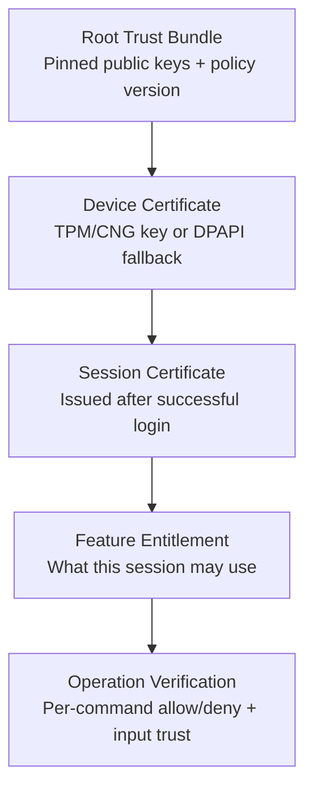
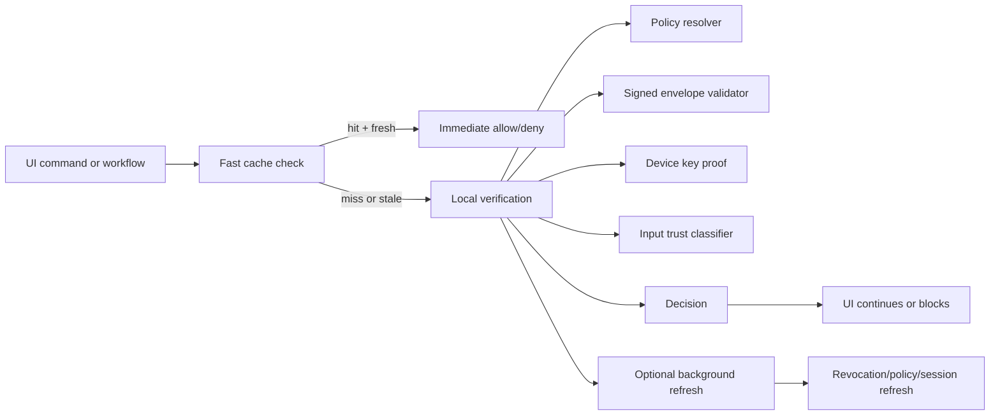

# Lightweight Hierarchical Verification for RetailStorePOS-Microsoft

## Executive summary

### Direct answer

The enabled connector scan via `api_tool` found one enabled connector: **GitHub**.

For **RetailStorePOS-Microsoft**, the best fit is a **phased hybrid architecture**: a **local in-process pyramid certification module** for all latency-sensitive and offline-critical decisions, plus **optional online attestation and proof-of-possession refresh** when connectivity exists. In practice, that means: a pinned root trust bundle, a device-bound key, short-lived session certificates, signed feature entitlements, and per-operation verification hooks. It is the strongest design that still fits this repo’s realities: WinUI desktop UI, local SQLite data, async startup, offline-capable workflows, and a hard requirement to avoid blocking the UI thread. The repo already gives you strong anchor points for this approach: background startup initialization in `MainWindow`, a centralized `LoginRuntime`, existing async command infrastructure, explicit workflow contracts, batched CSV import, and SQLite-backed repositories. fileciteturn22file0 fileciteturn23file0 fileciteturn24file0 fileciteturn32file0 fileciteturn39file0 fileciteturn40file0 fileciteturn41file0

Before building that module, there are three repo-specific issues that should be fixed first because they materially weaken any verification design placed on top of them. First, `LoginRuntime` currently auto-creates a bootstrap admin with username `admin`, password `1234`, and PIN `1234` on first run. Second, the current build/runtime flow places Supabase values into assembly metadata and reads them via reflection at startup. Third, `MainWindow` already performs time validation, but the UX permits continuing after a warning, which means the current time check is advisory rather than a hard trust gate. fileciteturn23file0 fileciteturn31file0 fileciteturn22file0

The practical implementation can be done **for free** using Windows and .NET primitives already aligned with the repo’s stack: **CNG/TPM-backed keys** where available, **DPAPI/ProtectedData** for local fallback storage, **ECDSA P-256** or a similarly supported modern signature algorithm, the repo’s existing **SQLite** store, and optionally an open-source policy engine later if the authorization model outgrows typed C# rules. Microsoft documents that Windows exposes TPM-backed key storage through the Platform Crypto Provider and that DPAPI/ProtectedData is Windows-native local secret protection; NIST, W3C, and IETF guidance supports phishing-resistant public-key authentication, proof-of-possession tokens, token validation best practices, and layered attestation/policy evaluation. citeturn8search0turn8search3turn6search2turn11search2turn11search4turn1search2turn1search6turn10search4turn3search1

### Reasoning

I did **not** find a recognized security standard under the exact phrase **“pyramid certification.”** The closest standards-backed concepts are: **hierarchy of trust** and certificate-chain reasoning, **X.509 certification path validation**, **layered remote attestation**, **phishing-resistant public-key authentication with step-up**, and **policy-based authorization**. Those concepts map well to what you appear to want: hierarchical trust, low-latency checks, offline support, and explicit rejection of unverified or malicious inputs. citeturn0search3turn4search1turn3search1turn11search2turn12search0

The uploaded internal notes also frame the offline reality correctly: on a customer-controlled machine, a fully offline verifier cannot be made uncrackable; the correct goal is **layered resistance**, raising attacker cost, eliminating trivial bypasses, and avoiding a single obvious `ValidateLicense()` gate. That insight strongly favors a **distributed verification design** tied to real feature execution, not one monolithic startup-only check. fileciteturn0file0

### Uncertainty and limits

Two terms in the request are non-standard and required interpretation. I read **“pyramid certification”** as a layered chain of trust and **“bait inputs”** as malformed, replayed, unsigned, or policy-violating inputs intended either to bypass business rules or to force expensive work. If you mean something narrower by either term, the module interfaces below can be adjusted without changing the architecture.

I also cannot claim measured performance numbers for this repo’s current code because I did not run the application. The latency and throughput values below are **recommended target SLOs**, not observed bench results.

## Repo analysis and concrete integration points

The repo is a **WinUI desktop application** whose main project targets `net10.0-windows10.0.19041.0`, references the **Windows App SDK**, and already carries the `System.Security.Cryptography.ProtectedData` package. Its data layer is a separate `net10.0` project using **Microsoft.Data.Sqlite** and **CsvHelper**. That combination is a good fit for a local-first verifier because it already gives you Windows-native key protection and a lightweight local database for signed policy snapshots, revocation snapshots, and verification caches. fileciteturn45file0 fileciteturn46file0

`MainWindow_Loaded` is already structured around **non-blocking startup**: it starts a splash animation, executes heavy runtime initialization on a background thread with `Task.Run(() => LoginRuntime.Initialize())`, imports telemetry in the background, then performs UI transitions asynchronously. That is exactly where the verifier should initialize its trust bundle, open or create a device key, warm its cache, and schedule any online refresh without blocking first paint. The same method also reveals that the app already has a **time validation loop**, but the dialog lets the user continue after a warning, which means the current system-time signal is not being used as an enforceable trust policy for sensitive operations. fileciteturn22file0

`LoginRuntime` is the natural central dependency injection point, even though the app uses static runtime wiring rather than a formal DI container. It initializes the SQLite connection factory, preferences, telemetry, repositories, auth service, register sessions, and product search. It also seeds Supabase values from environment variables or assembly metadata, starts background telemetry sync, and currently auto-creates a first-run admin account with known credentials. A verifier service should be attached here so it can issue session capabilities after sign-in, expose a process-wide `VerificationService`, and log decisions through the same runtime telemetry channel. The default bootstrap credentials should be removed before rollout. fileciteturn23file0

The repo already contains a surprisingly useful abstraction for hierarchical enforcement: `ModuleContract`, `WorkflowBoundary`, and `InventoryWorkflowContract`. Those contracts explicitly model a workflow coordinator, participating modules, offline allowance, and write sequencing. That is almost the right abstraction for a **verification requirement matrix**: instead of scattering ad hoc checks, you can attach required assurance levels to contracts and workflows, then verify at the point the contract is exercised. fileciteturn34file0 fileciteturn35file0 fileciteturn41file0

`ProductsPage` is already designed with cancellation, progress reporting, async file picking, background CSV import, and import-state gating. `ProductImportService` already implements batched import with `PRAGMA journal_mode=WAL`, `PRAGMA synchronous=NORMAL`, progress reporting, duplicate suppression, and a **tiered identity strategy**: product lookup by **Product DNA**, then **barcode**, then **exact name**. That tiered pattern is conceptually close to the “pyramid” idea, but it is currently a **business identity resolution pipeline**, not a security trust chain. It should remain that way; `ProductDnaGenerator` is useful for catalog identity, but it is not a security certificate and should not be reused as one. fileciteturn32file0 fileciteturn39file0 fileciteturn47file0

`ProductRepository` already supports `GetByIds`, but `CheckoutViewModel` still contains per-item verification-style reads in `CheckAndNotifyLowStock`, which is exactly the kind of avoidable N+1 pattern you do **not** want a verification system to repeat. The verifier should batch operation checks, batch import-row checks, and deduplicate concurrent requests with async memoization. fileciteturn40file0 fileciteturn30file0

`RelayCommand` and `AsyncRelayCommand` exist, which is useful for scheduler-friendly hooks, but the current async command implementation still uses fire-and-forget execution. That means a verifier should explicitly manage cancellation, result caching, deduplication, and exception flow instead of assuming command wrappers will do it automatically. Also, `StartupTrace` still calls `File.AppendAllText` under a lock, so any new verification logging should use a bounded async queue and batched flushes rather than synchronous disk I/O on hot paths. fileciteturn24file0 fileciteturn44file0

The most useful concrete hook points are these:

| Existing location | Why it is a natural hook | What to add |
|---|---|---|
| `MainWindow_Loaded` | app bootstrap, splash, async startup | initialize verifier, load trust bundle, warm cache, start non-blocking refresh |
| `LoginWindowViewModel.LoginWithPassword` / `LoginWithPin` | session establishment | mint short-lived session certificate and attach assurance level |
| `MainWindow.NavigateToTag` / `UpdateNavigationAccess` | feature entry points | perform cheap feature-level capability checks |
| `CheckoutViewModel.CompleteSale` | core financial write | enforce session + device + feature trust before committing sale |
| `MainWindow.CloseRegister_Click` / cash operations | privileged financial operations | require step-up verification |
| `ProductsPage.ImportDataButton_Click` | untrusted file ingress | run prefilter, signed-source validation if available, batch verification |
| `ProductImportService.TryCreateProduct` / `FlushBatch` | row-level validation and dedupe | verify schema, ranges, replay, source trust, anomaly thresholds |
| `LoginRuntime.ResetFreshStartAsync` | destructive state reset | require highest assurance level and signed override if offline |

Those hook points are grounded in the repo files cited above. fileciteturn22file0 fileciteturn23file0 fileciteturn25file0 fileciteturn30file0 fileciteturn32file0 fileciteturn39file0

## Threat model and target SLOs

The right threat model for this app is the same one raised in the uploaded offline-licensing notes: the attacker may control the machine, the clock, the debugger, process memory, the executable on disk, and local state. For this repo, the concrete attack surface includes client patching, first-run bootstrap credentials, packaged metadata secrets, local state rollback, malicious CSV imports, replay of locally cached decisions, and any verification path that becomes a single branch easy to bypass. fileciteturn0file0 fileciteturn23file0 fileciteturn31file0 fileciteturn39file0

For the online part of the design, the principal threats are token replay, confused-token use, weak JWT validation, and weak session-to-device binding. IETF guidance now treats **sender-constrained tokens** and **strict validation rules** as first-class concerns: DPoP is explicitly designed to sender-constrain tokens and detect replay attacks; the OAuth 2.0 Security BCP updates earlier guidance to reflect modern attack patterns; and JWT BCP guidance calls for algorithm allowlisting, audience/issuer validation, explicit typing, and mutually exclusive validation rules across token types. citeturn1search6turn1search3turn10search4

For higher-assurance authentication, the relevant standards are also clear. NIST SP 800-63B-4 treats **phishing-resistant**, **non-exportable**, **public-key-based** authenticators as the basis for AAL3-style high assurance and explicitly notes that step-up authentication can raise a session’s assurance level when needed. WebAuthn Level 3 defines strong, scoped, attested public-key credentials; Microsoft’s TPM and CNG documentation explains how Windows exposes non-exportable, hardware-backed keys through the Platform Crypto Provider. citeturn11search2turn11search4turn1search2turn8search0turn8search3

For hierarchical trust semantics, there are two standards-backed models that matter. If you want a full certificate-chain model, X.509 path validation and hierarchy-of-trust reasoning are defined in RFC 5280 and Microsoft’s hierarchy-of-trust documentation. If you want a lighter application-specific chain, RFC 9334’s **layered attestation** model is a cleaner conceptual fit: an attester produces evidence, a verifier appraises it against reference values and policy, and a relying party consumes attestation results using its own appraisal policy. That pattern maps almost directly to a local verifier plus optional online refresh. citeturn4search1turn0search3turn3search1

The recommended performance targets for this app should be aggressive enough to stay invisible to the cashier and conservative enough for a 2-core / 4 GB machine. These are target SLOs for the new verifier, not current measurements:

| SLO target | Recommended target |
|---|---|
| Hot-path feature check from memory cache | p95 ≤ 2 ms, p99 ≤ 10 ms |
| Cold local decision with signature + policy evaluation | p95 ≤ 25 ms, p99 ≤ 50 ms |
| UI-thread work added by verifier | ≤ 1 ms per interaction |
| Startup blocking budget added by verifier | warm ≤ 150 ms, cold ≤ 400 ms |
| Network refresh timeout | 1–3 s, always off the critical path |
| Memory budget for verifier cache/state | ≤ 64 MB steady state |
| Background worker count on 2-core machine | 1–2 bounded workers |
| Import verification batch time | 50–150 ms per batch |

The design implication is simple: **never put network, disk, or hardware-attestation latency on the UI thread**. Every expensive operation must be cacheable, bounded, or moved off-thread; every high-risk decision must fail closed; and every low-risk decision should support stale-while-revalidate behavior.

## Candidate architectures and trade-offs

The exact phrase **“pyramid certification”** is not a standard term, but the combination you want is well represented by three architecture families: a **local hierarchical certification module**, a **zero-trust short-lived token service**, and a **hybrid attestation model**. The comparison below is based on the repo’s offline nature, the Windows client platform, the requirement for low latency, and current standards around proof-of-possession, public-key authentication, policy engines, and attestation. citeturn3search1turn1search6turn11search2turn12search0turn9search1turn9search6

| Candidate | Core mechanism | Security | Latency | Client resource use | Implementation complexity | Suitability for this repo |
|---|---|---:|---:|---:|---:|---:|
| Local pyramid certification module | pinned root key + signed local policy/feature/session envelopes + device binding | High against casual tampering, moderate against expert local patching | Excellent | Low | Medium | Very high |
| Zero-trust token-based | online auth server + very short-lived PoP tokens + centralized policy engine | Very high online, weak offline continuity | Good when online | Low on client, higher on server | Medium-high | Medium |
| Hybrid attestation | local pyramid core + optional TPM/device attestation + online refresh/revocation/PoP | Highest balanced security | Excellent on hot path | Low-medium | High | Highest |

The **local pyramid module** is the best purely offline option. It is cheap, fast, and can be built entirely with Windows/.NET primitives. It should use a pinned trust root, signed local envelopes, distributed feature hooks, and device binding. It is also the easiest way to avoid blocking the UI. The weakness is fundamental: local code still runs on the attacker’s machine, so a highly motivated attacker can patch or hook it. That limitation is not specific to this repo; it is an inherent offline-client constraint. fileciteturn0file0

The **zero-trust token model** is attractive if you can assume reliable connectivity. OAuth BCP guidance and DPoP make this architecture robust against replay and token theft, and a decoupled policy engine such as **OPA** cleanly separates business logic from authorization logic. But for a POS app whose core workflows must remain usable during connectivity loss, a pure online token design is too brittle. OPA’s model of decoupled policy evaluation is still useful, but it should not be the only enforcement layer here. citeturn1search3turn1search6turn9search1

The **hybrid attestation model** is the best overall answer for this repo because it preserves offline operation while still giving you a way to bind sessions to a device, refresh revocations, and raise assurance when online. The attestation idea comes directly from the RATS model: evidence, verifier, appraisal policy, relying party. Windows TPM and Platform Crypto Provider support provide the practical device-binding mechanism on the client. NIST’s step-up guidance gives you the security model for escalating assurance only for sensitive operations. citeturn3search1turn8search0turn8search3turn11search2turn11search4

The recommended choice is therefore:

**Select the hybrid attestation architecture, but implement it in phases so that phase one is a local pyramid module.**  
That gives you the lowest-risk path to production and the best long-term security.

## Recommended module design and integration plan

The recommended design is a **five-layer trust pyramid**. The lower layers are slow-moving and pinned; the higher layers are short-lived and operation-specific.



At the bottom, the app ships with a **pinned root public key** and a signed trust-bundle format. This is lighter than full X.509 path handling, but it still follows the same logic as hierarchy-of-trust and path validation: a trust anchor signs the next level, and validation fails if the chain, freshness, audience, or policy do not match. RFC 5280 and Windows hierarchy-of-trust documentation are still the right conceptual reference points. citeturn4search1turn0search3

The **device layer** should create a non-exportable key using the **Microsoft Platform Crypto Provider** when a TPM is available; otherwise it should fall back to a software key protected with **DPAPI/ProtectedData** and mark the device at a lower assurance level. Microsoft documents both the TPM-backed Platform Crypto Provider and Windows DPAPI for local secret protection. That gives you a free, Windows-native foundation without introducing a heavy PKI service. citeturn8search0turn8search3turn6search2

The **session layer** should be created after `LoginWithPassword` or `LoginWithPin` succeeds. The session certificate should be short-lived and carry: `sub`, `roles`, `aal`, `device_id`, `issued_at`, `expires_at`, `policy_version`, and a replay-resistant `jti`. For network calls, use sender-constrained tokens or signed request proofs so a copied bearer token is not enough. DPoP is the standards-backed model here, and JWT BCP guidance should be followed if you package decisions into JWT/JWS-like envelopes. citeturn1search6turn10search4turn1search4

The **feature layer** should turn the repo’s current role/flag model into explicit entitlements. Today the app performs access shaping through methods like `UpdateNavigationAccess`, `CanOverridePrice`, and page-level behavior. That should be replaced or supplemented by signed entitlements evaluated by a central `VerificationService`. The repo’s current `ModuleContract` and `WorkflowBoundary` infrastructure is the clean way to define which workflows are offline-allowed and what assurance they require. fileciteturn22file0 fileciteturn30file0 fileciteturn34file0 fileciteturn35file0 fileciteturn41file0

The **operation layer** is where “block unverified / bait inputs” actually becomes concrete. Every sensitive command should evaluate four things in order:

1. **cheap prefilter**  
   file type, size, schema, range, nullability, rate limits, duplicate/replay keys, obviously impossible values

2. **session + device trust**  
   valid session, bound to this device, not expired, policy version acceptable

3. **feature entitlement**  
   action allowed for this role and current workflow boundary

4. **risk escalation**  
   if action is privileged, require step-up or fresher evidence

This matches the repo well because `ProductsPage.ImportDataButton_Click`, `ProductImportService`, `CheckoutViewModel.CompleteSale`, and `CloseRegister_Click` are already identifiable, real business boundaries. fileciteturn32file0 fileciteturn39file0 fileciteturn30file0 fileciteturn22file0

### Core interfaces

A practical interface set for this repo is:

```text
IVerificationService
IDeviceIdentityProvider
ISignedEnvelopeValidator
IFeatureEntitlementStore
IOperationPolicyResolver
IInputTrustClassifier
IVerificationCache
IVerificationTelemetry
```

A strongly typed C# implementation is the best first step. If policy complexity grows, `IOperationPolicyResolver` can be replaced with an embedded or sidecar policy engine later. **OPA** is a strong general-purpose option for decoupled policy evaluation, while **Cedar** is attractive when you want policy readability plus more formal assurance around policy behavior. citeturn9search1turn12search0turn9search0turn12search5

### Data flow

The recommended runtime flow is this:



The critical rule is that **the online path never sits in the critical sync path for normal POS operations**. If the cache is valid and the local chain verifies, the operation should proceed. The online path is for revocation, fresh attestation, rotated policy, and stronger evidence when available.

### Storage

Use a dedicated verification namespace in the existing SQLite database, or a separate local SQLite file if you want clean rollback and repair behavior. The minimal objects are:

- `device_identity`  
  device ID, provider type, attestation level, public key fingerprint

- `signed_policy_bundle`  
  current policy version, signature, effective range, offline grace

- `session_caps`  
  subject, device binding, assurance level, expiry, jti

- `verification_cache`  
  memoized decisions keyed by `(subject, device, action, resource, policyVersion, hash(input))`

- `clock_state`  
  monotonic last-seen values, signed last-trusted timestamp, rollback suspicion markers

- `verification_events`  
  batched telemetry/audit records

Using SQLite is a natural fit because the repo already depends on it and already batches import work efficiently using WAL mode. fileciteturn46file0 fileciteturn39file0

### Key management

The key hierarchy should be:

- **issuer root private key**  
  offline, never shipped, ideally held outside the client build chain

- **issuer intermediate key**  
  optional, used to sign policy bundles and entitlements

- **device private key**  
  TPM/CNG non-exportable where possible; DPAPI-protected software fallback otherwise

- **session signing / challenge proof key**  
  derived from or bound to the device key, not a long-lived root

The client ships only with public verification material. That matches the core offline-licensing principle from the internal notes and avoids trusting secrets embedded in the artifact. The current assembly-metadata pattern for Supabase values is therefore the wrong place for anything privileged. fileciteturn0file0 fileciteturn23file0 fileciteturn31file0

Use **ECDSA P-256** unless you have a stronger reason to choose something else, because Microsoft documents broad CNG support for ECDSA curves and CNG key storage patterns. If you serialize claims into JWT/JWS-like envelopes, follow JWT BCP guidance strictly and use explicit token typing so a session token cannot be mistaken for a feature token. citeturn7search3turn7search2turn10search4

### Failure modes, degradation, monitoring, and rollback

The verifier should degrade **by risk class**, not by technical subsystem.

- If **network refresh** fails, continue with locally valid cached policy and local device/session proof.
- If **clock rollback suspicion** is raised, continue read-only functions and block re-licensing, user-management, and other trust-critical operations until fresh evidence is obtained.
- If **device key state** becomes corrupt, fall back to a repair flow that preserves data access but blocks privileged operations.
- If **policy bundle** becomes stale beyond its grace window, allow only workflows explicitly marked offline-critical.
- If **input trust** fails, quarantine the specific input or batch; do not stall the whole UI.

Monitoring should integrate with the repo’s existing runtime logging/telemetry patterns, but not by reusing synchronous `StartupTrace` on hot paths. Use a bounded channel and background flush worker instead. The repo already logs lifecycle and telemetry events centrally through `LoginRuntime`; that is where verification events should go. fileciteturn22file0 fileciteturn23file0 fileciteturn44file0

Rollback should be guarded by a **signed rollback manifest**. Do not add an unsigned local “disable verification” flag. Safe rollback means:
- signed policy version pinning
- shadow-mode and soft-enforce deployment phases
- dual logging of legacy and new decisions
- one-step reversion to last known good signed bundle

## Core algorithms and verification hooks

The repo already shows the right direction: async startup in `MainWindow`, async sign-in commands in `LoginWindowViewModel`, and background import work with progress and cancellation in `ProductsPage`. The pseudocode below extends those existing patterns instead of fighting them. fileciteturn22file0 fileciteturn24file0 fileciteturn25file0 fileciteturn32file0

### Fast non-blocking verification path

```pseudo
function EvaluateAsync(request, cancellationToken):
    key = CacheKey.from(request.subject,
                        request.deviceId,
                        request.action,
                        request.resourceId,
                        request.policyVersion,
                        hash(request.inputFingerprint))

    // Hot path: memory cache
    if DecisionCache.tryGetFresh(key, out cachedDecision):
        return cachedDecision

    // Deduplicate concurrent misses
    task = InFlight.GetOrAdd(key, () => AsyncLazy(async:
        try:
            precheck = CheapPrefilter(request)
            if precheck.isDeny:
                return Deny(precheck.reason, assurance="none")

            deviceState = await DeviceIdentityProvider.GetStateAsync(cancellationToken)
            if not deviceState.isUsable:
                return DegradeOrDeny(request, "device_unusable")

            session = await SessionStore.GetAsync(request.sessionId, cancellationToken)
            if session is null or session.isExpired:
                return Deny("session_invalid", assurance="none")

            if session.deviceId != deviceState.deviceId:
                return Deny("device_mismatch", assurance="none")

            entitlement = await EntitlementStore.GetAsync(request.feature, cancellationToken)
            if not SignedEnvelopeValidator.Validate(entitlement, request.policyVersion):
                return DegradeOrDeny(request, "entitlement_invalid")

            policy = PolicyResolver.Resolve(request.workflow, request.action)
            decision = policy.Evaluate(request, session, deviceState, entitlement)

            if decision.requiresStepUp and not session.aalSatisfies(decision.minAal):
                return Deny("step_up_required", assurance=session.aal)

            DecisionCache.put(key, decision, ttl=policy.cacheTtl)
            return decision
        finally:
            InFlight.remove(key)
    ))

    // Await the deduplicated task off the UI thread
    return await task
```

### Graceful degradation by risk class

```pseudo
function DegradeOrDeny(request, reason):
    risk = RiskClassifier.getRisk(request.workflow, request.action)

    if risk == "low":
        // stale-while-revalidate
        lastKnown = DecisionCache.tryGetStale(request)
        if lastKnown exists and lastKnown.age <= LOW_RISK_STALE_WINDOW:
            BackgroundRefreshQueue.enqueue(request)
            return AllowWithWarning(reason="stale_cache", source="degraded")

    if risk == "medium":
        if request.workflow.isOfflineCritical and LocalTrustSnapshot.isStillValid():
            BackgroundRefreshQueue.enqueue(request)
            return AllowWithWarning(reason="offline_grace", source="local_trust")

    return Deny(reason, assurance="insufficient")
```

### Batched input verification for imports

This matches the repo’s existing import pipeline, which already works in batches and reports progress every N rows. fileciteturn39file0

```pseudo
function VerifyImportBatchAsync(batchRows, importContext, cancellationToken):
    inputHeader = AnalyzeCsvHeader(importContext.filePath)
    if not inputHeader.matchesAllowedTemplate():
        return BatchResult.denyAll("invalid_header")

    if importContext.fileSize > MAX_IMPORT_SIZE:
        return BatchResult.denyAll("file_too_large")

    decisions = []
    seenKeys = HashSet()

    for row in batchRows:
        cancellationToken.throwIfCancellationRequested()

        // cheap row-level trust checks
        if row.name is empty:
            decisions.add(DenyRow(row, "missing_name"))
            continue

        if not row.price.isNumeric() or row.price < 0:
            decisions.add(DenyRow(row, "invalid_price"))
            continue

        replayKey = BuildReplayKey(row.productDna, row.barcode, row.name)
        if not seenKeys.add(replayKey):
            decisions.add(DenyRow(row, "duplicate_in_batch"))
            continue

        // feature-level verification once per row class, not once per field
        opRequest = VerificationRequest(
            workflow = "products.import",
            action   = "import_row",
            feature  = "inventory.products.maintain",
            inputFingerprint = replayKey,
            offlineCritical = false
        )

        decision = await EvaluateAsync(opRequest, cancellationToken)
        if decision.isAllow:
            decisions.add(AllowRow(row))
        else:
            decisions.add(DenyRow(row, decision.reason))

    return BatchResult.from(decisions)
```

### Session issuance after login

```pseudo
function IssueSessionCapability(authResult, deviceState):
    sessionClaims = {
        typ: "retail-pos/session-cap",
        sub: authResult.userId,
        roles: authResult.roles,
        aal: authResult.assuranceLevel,
        device_id: deviceState.deviceId,
        iat: nowUtc(),
        exp: nowUtc() + 15 minutes,
        jti: randomUuid(),
        policy_version: CurrentPolicy.version
    }

    signedSession = Issuer.Sign(sessionClaims)
    SessionStore.save(signedSession)
    return signedSession
```

### Verification hooks for the current repo

```pseudo
// MainWindow_Loaded
await Task.Run(() => LoginRuntime.Initialize())
_ = VerificationService.InitializeAsync(nonBlocking = true)

// LoginWindowViewModel.LoginWithPassword / LoginWithPin
if auth success:
    await VerificationService.CreateSessionAsync(currentUser)

// MainWindow.NavigateToTag
decision = await VerificationService.EvaluateAsync(
    workflow="navigation",
    action=tag,
    feature=MapTagToFeature(tag)
)
if deny: show access message; do not navigate

// CheckoutViewModel.CompleteSale
decision = await VerificationService.EvaluateAsync(
    workflow="checkout.complete_sale",
    action="commit",
    feature="sales.checkout",
    inputFingerprint=hash(cart + totals + cashier)
)
if deny: show status; return
commit sale

// MainWindow.CloseRegister_Click
decision = await VerificationService.EvaluateAsync(
    workflow="register.close",
    action="close_register",
    feature="register.close",
    requireStepUp=true
)
if deny: block dialog finalization

// ProductsPage.ImportDataButton_Click
decision = await VerificationService.EvaluateAsync(
    workflow="products.import",
    action="start_import",
    feature="inventory.products.maintain"
)
if deny: return
run VerifyImportBatchAsync inside existing background import path
```

### Logging without hot-path blocking

```pseudo
background VerificationLogWorker:
    while await Channel.Reader.WaitToReadAsync():
        batch = Channel.Reader.ReadUpTo(100 or 250ms)
        append batch to sqlite table
        optionally forward summary to TelemetryService
```

That last change is especially important because the repo has already seen UI lag tied to synchronous disk I/O in hot paths, and `StartupTrace` still writes synchronously today. fileciteturn44file0

## Deployment, alternatives, and implementation checklist

### Deployment and testing plan

Roll the verifier out in **three phases**:

**Shadow mode**  
The verifier runs everywhere, caches decisions, and logs allow/deny outcomes, but it does not block. This phase is purely for measuring false positives, p95/p99 latency, cache hit rate, and places where the current app workflow depends on weaker trust than expected.

**Soft-enforce mode**  
The verifier blocks only clearly privileged operations: register close, destructive resets, user-management mutations, settings mutations, and any future licensing/admin actions. Low-risk navigation and normal browsing remain permissive while you harden the policy map.

**Hard-enforce mode**  
All mapped operations enforce the new assurance model. The old checks remain for one release in dual-run telemetry so you can compare decisions and roll back by signed manifest if necessary.

Benchmarks should be executed on a **2 vCPU / 4 GB RAM** Windows test host, because that is the user-stated floor. Measure at least:
- warm startup cost added by verifier
- hot-cache decision latency
- cold local decision latency
- import batch latency and memory growth
- step-up latency for privileged operations
- background refresh failure behavior
- cache hit rate under realistic cashier activity

Security tests should include:
- replaying a stolen session certificate on a second machine
- tampering with clock state and local verifier tables
- patching the most obvious allow branch
- deleting or corrupting local trust bundle state
- importing malformed CSV with negative prices, duplicate identities, huge files, broken headers, and mixed encodings
- attempting privileged flows after sign-out or with downgraded assurance

CI/CD should add:
- build signing
- secret scanning
- policy bundle signing verification in pipeline
- unit tests for token typ/aud/iss validation
- property-based or fuzz tests for import parsers and signed-envelope parsers
- performance regression checks for hot-path decision latency

### Alternative methods if pyramid certification is unsuitable

If you conclude that the “pyramid” model is too custom or too tightly coupled to the client, the alternatives are these:

**Typed local policy only**  
Keep a local in-process verifier but use only typed C# rules and signed envelopes. This is the cheapest and simplest option. It is the right fallback if you want the smallest code delta and fully offline behavior, but it gives up some future flexibility.

**OPA-backed policy service**  
OPA is a mature open-source policy engine that decouples policy decisions from app logic and evaluates structured inputs against declarative policy. It is a good next step if your rules begin changing faster than your code. The trade-off is operational complexity and another runtime component. citeturn9search1

**Cedar-based authorization model**  
Cedar is an open-source authorization language and engine designed to separate authorization from business logic, with readable policies and a formal-verification-oriented development story. It is a good fit if the team wants more analyzable, auditable fine-grained authorization, but it is not the easiest first integration point for a WinUI desktop app. citeturn12search0turn9search0turn12search5

**OpenFGA or Zanzibar-style relation service**  
If this app eventually becomes part of a broader multi-user, multi-store, multi-service platform, a relationship-based authorization model becomes attractive. OpenFGA is open source, inspired by Zanzibar, and supports immutable authorization model versions, which is useful for rollback and auditability. For the current repo, though, it is likely overkill unless permissions rapidly expand beyond what a local POS client should own. citeturn9search6turn9search8turn9search2turn5search1

**Hardware-backed license container or dongle**  
If your true requirement is not just authorization but **very strong offline expiration and anti-clock-tamper enforcement**, then a hardware-backed licensing approach is stronger than any software-only client design. The internal notes are correct on this point. That route improves tamper resistance but increases cost, support burden, and deployment complexity. fileciteturn0file0

### Prioritized implementation checklist

| Priority | Task | Effort | Why first |
|---|---|---:|---|
| Highest | Remove first-run default admin credentials and PIN | Low | current code materially weakens trust root |
| Highest | Stop packaging privileged secrets in assembly metadata | Medium | packaged secrets undermine any client trust model |
| Highest | Add `VerificationService` to `LoginRuntime` and initialize in `MainWindow_Loaded` | Medium | creates the central integration point |
| High | Define assurance levels per `WorkflowBoundary` / `ModuleContract` | Medium | converts architecture into enforceable policy |
| High | Add session certificate issuance after login | Medium | enables low-latency per-feature checks |
| High | Add feature hooks to navigation, checkout commit, register close, import start | Medium | covers real business boundaries |
| High | Implement async cache, in-flight deduplication, and background refresh queue | Medium | keeps latency invisible on 2-core machines |
| High | Replace hot-path sync verification logging with channel-based batched logging | Low | avoids repeating prior lag patterns |
| Medium | Add device-bound key with TPM/CNG and DPAPI fallback | Medium | raises tamper cost without sacrificing compatibility |
| Medium | Add clock rollback suspicion model and offline-grace policy | Medium | strengthens offline trust without constant blocking |
| Medium | Add step-up assurance for destructive and admin operations | Medium | brings high-risk paths under stronger control |
| Medium | Add shadow-mode telemetry dashboard and rollout flags | Low | supports safe deployment and rollback |
| Later | Add optional online attestation / PoP refresh | High | best long-term control, but not needed for phase one |
| Later | Evaluate OPA / Cedar / OpenFGA if policy complexity grows | Medium-high | only necessary when rules outgrow typed local policies |

The shortest sensible path is:

- fix the immediate repo trust issues
- ship a **local pyramid core** first
- enforce on a handful of privileged workflows
- measure
- then add online attestation and broader policy externalization only if the product grows into it

That sequence gives you the best balance of **security, speed, offline continuity, and implementation cost** for the current RetailStorePOS-Microsoft codebase.