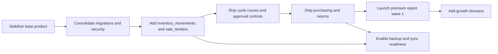

# RetailStorePOS Delivery and Development Plan

## Source review and business case

**Project Source Review**

This plan is grounded first in the selected GitHub repository `AbduarhmAN/RetailStorePOS-Microsoft` on branch `1.4.2`, then in the uploaded planning files that cover UI/XAML, future features, premium reporting, lightweight verification, and commercial channels. The repository evidence shows a two-project solution: a WinUI desktop application project (`Nexill.RetailStorePOS`) and a separate data/class-library project (`RetailStorePOS.Data`). The app project targets WinUI 3 on `net10.0-windows10.0.19041.0`, packages as MSIX, includes LiveCharts for reporting visuals, and references the data project; the data project uses `Microsoft.Data.Sqlite` and `CsvHelper`. fileciteturn21file0 fileciteturn22file0 fileciteturn9file0

The current application is best understood as a **Windows desktop, offline-first retail POS and store-operations app**. The runtime is intentionally local-first: the database path is normalized to a local path only, `pos.db` is stored under app data, preferences are persisted to a local `preferences.json`, secrets are stored locally using DPAPI-backed protection, and startup initializes the runtime on a background thread rather than blocking the UI thread. The app uses a single-window shell with one root frame, transitions from splash to login in the same window, and then routes users based on authentication and permissions. fileciteturn13file0 fileciteturn14file0 fileciteturn29file0 fileciteturn30file0 fileciteturn31file0 fileciteturn37file0

The modular-monolith inventory in the repo is unusually useful for planning because it already documents ownership boundaries. Confirmed modules and concerns include Products, Sales, Inventory, Tax, Users/Auth, Settings, Telemetry, Migrations, Reporting, and the app shell. The repo also explicitly records that Reporting is currently read-only, local preferences remain in-process, SQLite remains the single local data boundary, and no extra worker or service-host project exists. fileciteturn9file0

A concise source-based view of the application is below.

| Confirmed area | What the source supports |
|---|---|
| Application shape | Single WinUI desktop executable plus one data library; no extra service host or worker process. fileciteturn9file0 fileciteturn21file0 fileciteturn22file0 |
| Local data model | Local SQLite with `products`, `sales`, `sale_items`, `settings`, `telemetry_outbox`, `installation_events`, `users`, `sessions`, `audit_logs`, tax tables, `tender_types`, `bundle_components`, `register_sessions`, and `register_cash_adjustments`. fileciteturn15file0 |
| Operational features already present | Authentication and permission flags, product management and CSV import, checkout, tax calculation and snapshots, reporting metrics, register open/close and cash adjustments, audit logging, telemetry outbox, optional remote telemetry delivery. fileciteturn15file0 fileciteturn17file0 fileciteturn18file0 fileciteturn19file0 fileciteturn33file0 fileciteturn34file0 fileciteturn35file0 fileciteturn37file0 |
| Architectural direction | Modular contracts already define workflow boundaries for checkout, inventory, telemetry, migrations, and sync, which is a strong base for controlled incremental delivery. fileciteturn25file0 fileciteturn26file0 fileciteturn27file0 fileciteturn35file0 fileciteturn36file0 |
| Current UX and code structure hotspots | The uploaded UI audit identifies checkout composition, `ProductsPage.xaml.cs`, dashboard page code-behind, and the fragmented shared-style/token system as the main refactor candidates, while also recommending that the shell and navigation model remain intact. fileciteturn0file0 |
| Confirmed next feature candidates | The uploaded future-features roadmap prioritizes cycle counting, purchase orders/receiving, returns/exchanges, approval workflows, replenishment, transfers, customer/loyalty, promotions, stored value/tender expansion, and backup/sync readiness. The premium-report roadmap prioritizes SKU profitability, dead stock/aging, ABC-XYZ, replenishment risk, markdown effectiveness, shrink/audit, cashier exception risk, and basket analysis. fileciteturn0file2 fileciteturn0file3 |

The source also reveals several important **gaps that should be treated as real scope, not assumed capability**. The bootstrap schema and sale persistence path do not show customer, supplier, purchase-order, return, multi-tender allocation, or inventory-movement ledger tables today. `SaleRepository` still stores a single `payment_type` on the sale header and applies stock decrement during sale completion rather than writing a general movement ledger. Those choices are fine for the current product, but they become bottlenecks for procurement, returns, replenishment, advanced analytics, sync, and stored-value workflows. fileciteturn15file0 fileciteturn33file0 fileciteturn0file2

There are also clear **requires confirmation** areas. Full business-data sync beyond telemetry is not confirmed by the repo; only the `SyncWorkflowContract` establishes the boundary. Multi-store expansion beyond the current store/warehouse quantity model is not confirmed. External payment processor integrations are not confirmed. A formal automated test project or CI gate is not visible in the inspected source, and the register-opening-control tasks explicitly say no test tasks were generated for that feature. A quantified release date, staffing model, budget, pricing model for premium modules, and committed commercial targets are all **requires confirmation**. fileciteturn26file0 fileciteturn12file0 fileciteturn0file2

**Business Case**

The business problem the application already addresses is clear from the current source: small retail operations need a POS and store-management app that can continue working locally, support cashier/admin workflows, track products and inventory-related quantities, enforce user permissions, capture tax logic, record register activity, and produce store-level reports without requiring always-on cloud connectivity. The app already solves the first half of that problem. The second half—turning operational data into tighter inventory control, procurement decisions, premium reporting, and commercially differentiated modules—is only partially built and is where the next development investment should go. fileciteturn15file0 fileciteturn33file0 fileciteturn35file0 fileciteturn37file0 fileciteturn0file2 fileciteturn0file3

The target users are also reasonably clear. From the product source, there are at least cashier, admin/owner, settings, product-management, tax-management, user-management, and reporting personas because those permission flags and workflows are already in the schema and shell navigation. From the commercial research file, the economic buyer is a retail store owner or small-business decision maker evaluating POS and retail-management software. fileciteturn15file0 fileciteturn35file0 fileciteturn37file0 fileciteturn0file4

The business value case should therefore be stated in two layers. First, the app protects **core store operations** by keeping checkout, register control, and local data working without cloud dependency. Second, the roadmap can increase **store performance and product differentiation** by adding higher-value operational controls and manager intelligence: inventory movement accuracy, cycle counting, replenishment support, purchase receiving, returns control, and premium analytics based on margin, aging stock, and inventory prioritization. The uploaded roadmap and report research explicitly support this sequence. fileciteturn9file0 fileciteturn33file0 fileciteturn0file2 fileciteturn0file3

The market opportunity that is actually confirmed by the provided materials is not a fully quantified TAM; it is a **reachable buyer market**. The uploaded commercial research recommends Google Search, LinkedIn, software review/comparison sites such as Capterra/G2/Software Advice, then Meta retargeting and organic trust/content channels as the strongest mix for reaching retail software buyers and store owners. That is enough to justify a commercial growth path, but a formal market-sizing model still **requires confirmation**. fileciteturn0file4

Success criteria should be stage-specific rather than vague. For the current continuation project, the right top-level criteria are: preserve the current offline-safe transaction core; remove confirmed security hazards; stabilize migrations and schema ownership; add the missing operational ledgers that future features depend on; ship one operational-control wave; and then ship one monetizable analytics wave. Exact numeric targets for adoption, revenue, churn, or cost are **requires confirmation** because the source does not provide them. fileciteturn15file0 fileciteturn20file0 fileciteturn33file0 fileciteturn0file2 fileciteturn0file3

## Benefits and requirements

**Benefits Case and Benefits Management Plan**

The source already shows that some benefit measurement hooks exist today. Sales and dashboard methods can already calculate revenue, profit, invoice count, discount amount, median invoice, and top products. Telemetry tables and runtime state already exist for lifecycle events and optional outbox delivery. Audit logs and register-session tables already support some governance measurement. What is missing are the ledger structures needed to measure inventory accuracy, purchasing performance, returns behavior, and tender-level behavior with confidence. fileciteturn17file0 fileciteturn18file0 fileciteturn19file0 fileciteturn33file0

The benefits plan should therefore distinguish between **benefits measurable now** and **benefits measurable only after foundation work**.

| Benefit | How it should be measured | Current measurement readiness | Benefit owner | Validation method | Target timeline |
|---|---|---|---|---|---|
| Stable store operation | Startup success, crash/unclean-exit rate, successful sale creation, register-open completion, time-to-first-transaction | Partly measurable today through installation events, runtime state, and sales/register tables. fileciteturn18file0 fileciteturn19file0 fileciteturn33file0 | Requires confirmation | Before/after release comparison on pilot stores | First foundation release |
| Better privilege and governance control | Removal of default admin bootstrap, audit coverage of privileged actions, unauthorized-action rejection rate | Partly measurable today through `users`, `audit_logs`, and future guard logs; current default bootstrap is a confirmed issue. fileciteturn15file0 fileciteturn20file0 | Requires confirmation | Security acceptance review plus pilot audit review | First foundation release |
| Better inventory accuracy | Inventory variance, cycle-count completion rate, stock adjustment reasons, stockout frequency | Not fully measurable until inventory-movement and count-session tables exist. fileciteturn15file0 fileciteturn33file0 fileciteturn0file2 | Requires confirmation | Pilot category baseline vs post-release | After operational-controls release |
| Better purchasing and replenishment decisions | Emergency orders, stock cover, late receipts, reorder compliance, aged stock reduction | Requires new purchasing and ledger entities. fileciteturn0file2 | Requires confirmation | Category pilot with pre-registered operational KPIs | After purchasing release |
| Better margin insight and monetizable analytics | Report adoption, GMROI, dead-stock reduction, ABC-XYZ usage, report export/share activity | Partly achievable after first-wave premium reports because cost, sales, and quantities already exist for several report types. fileciteturn33file0 fileciteturn0file3 | Requires confirmation | Backtests on historical data plus pilot-store usage analytics | After premium report wave |
| Better commercial pipeline efficiency | Qualified demos, trial-to-paid conversion, cost per qualified lead by channel | App source does not currently expose CRM/lead tracking. The channel strategy is source-backed; the measurement system still requires confirmation. fileciteturn0file4 | Requires confirmation | Paid-channel and review-site attribution dashboards | Commercial launch phase |

A practical benefits-management rule follows from the uploaded roadmap materials: **do not ship major future modules without a pilot and a pre-defined metric set**. That is especially important for premium reporting, replenishment science, loyalty, and promotions, where value depends on manager action and data quality rather than feature existence alone. fileciteturn0file2 fileciteturn0file3

**Project Requirements**

The requirements should be divided into what the source already commits the team to preserve, and what the next phase must add.

| Requirement class | What the project should require next |
|---|---|
| Functional requirements | Preserve login, role gating, checkout, reporting, settings, product management, tax handling, register session control, audit logs, local preferences, and telemetry as working capabilities; add inventory movement ledger, sale-tender ledger, cycle counts, stock adjustments, approvals, purchasing/receiving, returns controls, and premium report wave 1 before broader customer/loyalty work. fileciteturn15file0 fileciteturn33file0 fileciteturn35file0 fileciteturn37file0 fileciteturn0file2 fileciteturn0file3 |
| Non-functional requirements | Preserve offline-first behavior, nonblocking startup, single local source of truth, and one-window shell. Add explicit performance budgets for hot screens and startup, because the UI audit identifies checkout, products, and dashboard as current hotspots. fileciteturn9file0 fileciteturn37file0 fileciteturn0file0 |
| Security requirements | Remove the default `admin/1234` bootstrap path; keep secrets in protected storage; apply deny-by-default for premium/privileged features; centralize feature activation for premium modules; review the current time-warning bypass so that sensitive workflows are not only advisory. The provided lightweight-verification research supports a centralized, nonblocking feature-guard approach for this purpose. fileciteturn20file0 fileciteturn30file0 fileciteturn37file0 fileciteturn0file1 fileciteturn0file5 fileciteturn0file7 |
| Performance requirements | Keep the application responsive on modest hardware and treat hot-path verification, search, and list rendering as in-memory or background-thread work. Microsoft’s guidance supports using lighter templates, virtualization, and deployment choices that fit the install environment; SQLite WAL remains compatible with same-host local concurrency. fileciteturn0file0 citeturn0search2turn0search3turn0search1 |
| Offline-first requirements | Local SQLite and local preferences remain the source of truth; remote telemetry and any future sync must remain optional and must not block checkout or startup. The module contracts already encode this intent. fileciteturn9file0 fileciteturn25file0 fileciteturn26file0 fileciteturn27file0 |
| Database requirements | All schema evolution should move through the migrations module, not through ad hoc repository-time `ALTER TABLE` calls. Database validation, startup-safe vs heavy migrations, and existing-user upgrade safety should be preserved and strengthened. fileciteturn15file0 fileciteturn25file0 fileciteturn33file0 |
| Reporting requirements | Continue using the existing in-app reporting for operational dashboards, and build premium reports from stable read models. Consider Power BI paginated reports only after exported/read-model datasets are stable and there is a confirmed business need for print-perfect or executive reporting. Power BI paginated reports are designed for print-ready/export-heavy scenarios. fileciteturn33file0 fileciteturn0file3 citeturn2search1turn2search7turn2search8 |
| Deployment requirements | Keep MSIX packaging, but make an explicit decision between the current self-contained distribution and framework-dependent deployment. Microsoft documents that framework-dependent deployment is the default and more resource-efficient, while self-contained deployment packages dependencies with the app. fileciteturn21file0 citeturn0search1turn0search3turn1search0turn1search3 |

One requirement deserves special emphasis because it cuts across product, engineering, and monetization: **premium or advanced modules should not be implemented as scattered checks**. If advanced reports, approvals, or premium features are introduced, the provided security design files support implementing them behind a centralized feature-activation layer that is lightweight at runtime and compatible with offline operation. fileciteturn0file1 fileciteturn0file5

## Roadmap and Gantt

**Development Roadmap**

The safest roadmap is **not a redesign roadmap**. The source does not justify replacing WinUI, replacing SQLite, or breaking the modular-monolith direction. The repo already has the right overall shape: local data, explicit boundaries, background startup, local preferences, optional telemetry, and a working sales/product/reporting foundation. The right roadmap is therefore: harden the current core, add the missing ledger foundation, deliver the next operational-control wave, then monetize the read side. fileciteturn9file0 fileciteturn15file0 fileciteturn20file0 fileciteturn37file0

The order should follow dependency reality, not feature temptation. The uploaded future-features roadmap already argues that cycle counting should come before purchasing, and that stored value, promotions, and customer/loyalty should come later. The premium-report roadmap separately argues that the first report wave should focus on SKU profitability, dead stock/aging, and ABC-XYZ because the current app already captures enough data for those to be practical sooner than more advanced forecasting or customer analytics. fileciteturn0file2 fileciteturn0file3

The resulting roadmap is:

- **Must-have first:** security and migration hardening, inventory/tender ledger foundation, UI/performance hotspot cleanup, cycle counting and stock adjustments, approval workflow.
- **Should-have next:** purchase orders/receiving, returns/exchanges controls, premium report wave 1.
- **Future after that:** replenishment workbench, advanced transfers, customer accounts/loyalty/digital receipts, promotions, stored value, backup/sync readiness, optional enterprise reporting. fileciteturn0file2 fileciteturn0file3

**Gantt Chart**

The timeline below is an **indicative sequencing model**, not a committed schedule. It is inferred from the current repository size, the uploaded roadmap complexity rankings, and the fact that no confirmed staffing model was provided. The durations therefore **require confirmation** before they are used as delivery commitments. fileciteturn0file2 fileciteturn0file3

| Phase | Task | Estimated duration | Dependencies | Deliverables | Priority |
|---|---|---:|---|---|---|
| Foundation | Confirm scope, branch baseline, pilot goals, and acceptance criteria | 1–2 weeks | None | Agreed backlog, scope log, confirmation list | Must-have |
| Foundation | Remove default bootstrap admin, confirm secure secret-seeding policy, define privileged-feature guard approach | 1–2 weeks | Scope confirmation | Security baseline release | Must-have |
| Foundation | Consolidate schema evolution into migrations; remove repository-time schema drift patterns | 2–3 weeks | Security baseline | Migration backlog, upgrade rehearsal scripts, cleaned repositories | Must-have |
| Data platform | Add `inventory_movements` and `sale_tenders` plus read-model updates | 3–4 weeks | Migration consolidation | Foundational ledger schema and repository contracts | Must-have |
| Application stabilization | Refactor checkout/products/dashboard hotspots; add search debouncing and shared resource dictionaries | 3–4 weeks | Security baseline; may run partly in parallel with data platform | Faster UI, cleaner ViewModel boundaries, shared tokens | Must-have |
| Operational controls | Ship cycle counting, stock adjustments, and exception/approval workflow | 3–5 weeks | Ledger foundation | Operational-controls wave | Must-have |
| Operations expansion | Ship purchase orders, suppliers, receiving, and receipt of stock into ledger | 4–6 weeks | Ledger foundation; cycle count preferred first | Purchasing wave | Should-have |
| Policy and recovery | Ship returns/exchanges/refund controls with audit and approval hooks | 3–5 weeks | Ledger foundation; approvals | Returns controls wave | Should-have |
| Monetization | Ship premium reports wave 1: SKU profitability, aging stock, ABC-XYZ | 3–4 weeks | Ledger foundation; report read models | Premium analytics wave | Should-have |
| Resilience | Design backup/restore and optional sync readiness | 4–6 weeks | Stable financial/event schemas | Recovery/sync readiness package | Future |
| Growth | Customer/loyalty/promotions/stored value | 6–10 weeks | Stable ledgers, returns, purchasing, report maturity | Growth-domain wave | Future |

The logic behind that Gantt sequencing is straightforward. The app can already sell, report, and manage products locally, so the highest-return development is the work that makes those capabilities safer, more measurable, and more extensible. That is why security hardening and schema/ledger work come before advanced commercial or customer features. fileciteturn15file0 fileciteturn20file0 fileciteturn33file0 fileciteturn0file2

## Management plan and technology options

**Management Plan**

The best delivery method here is a **stage-based incremental delivery model**: preserve the current architecture, run development in short implementation windows, and use formal stage boundaries before moving from foundation to ledgers, from ledgers to operational controls, and from operational controls to monetized reports. That fits both PRINCE2-style stage control and PMBOK-style progressive elaboration, and it also matches what the source is telling us: this codebase is additive and modular enough to continue safely, but not well-served by a “rewrite everything” program. fileciteturn9file0 fileciteturn11file0 fileciteturn0file0

The milestone structure should be:

| Milestone | Exit criterion |
|---|---|
| Source baseline fixed | Repo branch, scope assumptions, unclear areas, and acceptance criteria documented |
| Security baseline complete | No default bootstrap admin path; secure secret policy agreed; privileged-feature guard design approved |
| Migration baseline complete | Migrations consolidated; repository-time schema drift removed or quarantined; upgrade rehearsal passed |
| Ledger foundation complete | `inventory_movements` and `sale_tenders` available; read models updated |
| Operational-controls pilot ready | Cycle counts, approvals, and register/sales behavior tested in pilot build |
| Purchasing/returns wave ready | New workflows validated against operational pilot data |
| Premium analytics pilot ready | Wave-1 premium reports backtested against historical data |
| Commercial readiness gate | Deployment mode, package signing, onboarding, pilot-channel pages, and support model confirmed |

The most important quality gates are technical, because today the delivery risk is mostly technical rather than conceptual. The repository already contains a sound migration categorization model—startup-safe versus heavier maintenance migrations—and explicit database validation hooks. Those must be retained, but the project should add four mandatory gates before any major release goes live: a migration rehearsal against a copied existing database, an offline smoke test for login/checkout/register/reporting, a performance smoke test for startup and hot screens, and a permission/audit smoke test for privileged workflows. fileciteturn15file0 fileciteturn25file0 fileciteturn37file0

The testing strategy should become materially stronger than what is visible today. The source does not show a test project in the inspected two-project solution shape, and the register-opening task list explicitly states that no test tasks were generated for that feature. That does not mean the product is untestable; it means the next delivery plan should explicitly add tests rather than assuming they already exist. The highest-value tests are migration tests, repository contract tests, checkout/register workflow smoke tests, telemetry outbox retry tests, CSV import validation/fuzz tests, and role/permission matrix tests. fileciteturn9file0 fileciteturn12file0 fileciteturn17file0 fileciteturn19file0 fileciteturn34file0 fileciteturn35file0

The release process should be ring-based. First ship foundation changes to internal/dev validation. Then ship to one or two pilot stores or pilot datasets. Then expose premium reports and advanced modules behind feature flags or signed entitlements, which is consistent with the uploaded nonblocking-verification design files. Finally, broaden release only after operational KPIs and support tickets show stability. fileciteturn0file1 fileciteturn0file5 fileciteturn0file2 fileciteturn0file3

Governance should be intentionally light but explicit. A minimal project board function is needed for business, product, and technical decision-making, but the specific owner names and organizational roles **require confirmation** because the source does not provide them. What can be defined now is the review rhythm: end-of-phase review, go/no-go exit criterion, risk log update, benefits baseline update, and change-control decision for any scope added after the ledger foundation phase. That keeps the project controlled without imposing unnecessary ceremony.

**Platform and Technology Options**

The technology decision should start from the fact that the current stack already fits the product problem well. The app is Windows-native, uses a single-project MSIX pattern, and persists local data in SQLite with WAL enabled. SQLite’s WAL mode improves read/write concurrency on the same host, while Microsoft’s Windows App SDK documentation confirms the trade-off between framework-dependent and self-contained deployment models. The safest option is therefore to **continue the current stack** unless a confirmed business requirement forces a platform shift. fileciteturn14file0 fileciteturn21file0 citeturn0search2turn0search1turn0search3turn1search0

| Option | What it means | Pros | Cons | Fit |
|---|---|---|---|---|
| Preserve current local-first stack | WinUI 3 + SQLite + MSIX + local JSON preferences + DPAPI secret storage + optional telemetry | Maximum reuse of proven code; keeps offline-first behavior; lowest redesign risk; matches current source exactly. fileciteturn21file0 fileciteturn22file0 fileciteturn29file0 fileciteturn30file0 | Windows-only; full multi-device/cloud sync still needs design; reporting portability is limited until export/read models improve | **Best fit now** |
| Extend current stack with Supabase for telemetry and selective sync | Keep local-first core; use Supabase Postgres/Edge Functions/RLS/Realtime for optional remote services | Aligns with existing telemetry path; official docs support Edge Functions, RLS, and Realtime; useful for remote entitlements, telemetry, and later sync. fileciteturn19file0 fileciteturn27file0 citeturn0search0turn0search4turn1search1turn2search4turn2search5 | Adds cloud operations, auth, data-governance, and conflict-resolution complexity; should not become source of truth too early | Strong second-step option |
| Add Power BI/Fabric reporting layer after read models stabilize | Keep the app as transaction system; publish curated datasets/reports externally | Good for print-perfect, PDF, executive, or embedded reports; Microsoft docs support paginated reporting and real-time analytics tooling. citeturn2search1turn2search7turn2search8turn2search3 | Licensing and admin overhead; not the first move for an SMB desktop POS; risk of overbuilding before schema maturity | Optional later-stage option |

The deployment choice inside Option 1 should be made deliberately rather than left as an inherited project default. The repository is currently configured for self-contained Windows App SDK packaging. Microsoft documents that framework-dependent deployment is the default and uses machine resources more efficiently, while self-contained deployment carries the Windows App SDK dependencies with the app. For controlled customer environments with standard Windows runtimes, framework-dependent MSIX may reduce package weight and servicing burden. For lower-friction field installs and tighter dependency control, the current self-contained path is defensible. fileciteturn21file0 citeturn0search1turn0search3turn1search3

The backend and sync strategy should also remain conservative. The repo already uses Supabase-style endpoints for telemetry, but the `SyncWorkflowContract` makes it clear that sync should consume owner-published exports and should not own local business data. That is the right direction. If sync is added later, it should be built on append-only or event-derived exports from `sales`, `sale_items`, `inventory_movements`, `sale_tenders`, and other owner-controlled tables—not by making a remote mirror the immediate live source of truth. fileciteturn19file0 fileciteturn26file0 fileciteturn33file0

For reporting tools, the recommendation is to keep **in-app operational reporting first**, because the repository already contains report metrics and charting support. Then, only after the read models stabilize, decide whether executive/print/report-sharing demand justifies a Power BI or Fabric layer. fileciteturn21file0 fileciteturn33file0 fileciteturn0file3 citeturn2search1turn2search8

Commercially, the uploaded research suggests the initial distribution-channel mix should be Google Search, LinkedIn, and software review sites first, followed by Meta retargeting and owned/organic trust presence. That is the best fit for a product that sells to intentional software buyers rather than broad consumer audiences. fileciteturn0file4

## Improvement opportunities and risk register

**Improvement Opportunities**

The highest-value improvements are the ones that remove confirmed friction or unblock multiple later features at once.

| Domain | Improvement | Impact | Difficulty | Why it should be prioritized |
|---|---|---:|---:|---|
| Security | Remove the default bootstrap admin credentials and replace first-run setup with a secure onboarding path | Very high | Low–medium | This is a confirmed, source-visible weakness and should not ship forward. fileciteturn20file0 |
| Database | Move all schema evolution into migrations and eliminate repository-time `ALTER TABLE` fallbacks in business methods | Very high | Medium | Current repository methods still perform schema checks and mutations, which increases upgrade risk and blurs ownership. fileciteturn15file0 fileciteturn33file0 |
| Data platform | Add `inventory_movements` and `sale_tenders` | Very high | Medium–high | This is the foundation for purchasing, returns, multi-tender, replenishment, sync, and several premium reports. fileciteturn15file0 fileciteturn33file0 fileciteturn0file2 |
| UI/UX | Refactor checkout, products, and dashboard hotspots; centralize tokens/resources | High | Medium | The uploaded UI audit identifies these as the biggest structural UI wins without requiring a redesign. fileciteturn0file0 |
| Testing/governance | Add test projects and release gates for migrations, offline smoke, permissions, and import flows | High | Medium | The current inspected source does not show a robust automated test surface, and one feature task explicitly skipped test tasks. fileciteturn12file0 fileciteturn9file0 |
| Reporting | Build premium report wave 1 on stable read models | High | Medium | The data needed for profitability, aging, and ABC-XYZ is much more available now than data for loyalty or advanced customer marketing. fileciteturn33file0 fileciteturn0file3 |
| Operations | Build cycle counts and approval/exception workflow before purchasing and loyalty | High | Medium | The future-features roadmap already places these earlier for dependency reasons and practical store value. fileciteturn0file2 |
| Sync/resilience | Keep sync optional until schemas stabilize; add backup/restore rehearsal | Medium–high | Medium–high | The sync boundary exists conceptually, but broader sync is not confirmed and should not outrun the ledger foundation. fileciteturn26file0 fileciteturn0file2 |
| Commercial | Build launch pages and review-site presence before broad paid expansion | Medium | Low–medium | The uploaded commercial research points to high-intent search/review/LinkedIn channels first. fileciteturn0file4 |
| Feature monetization | Implement centralized premium-feature activation for advanced modules | Medium | Medium | This supports future paid analytics/modules without spreading brittle checks through the app. fileciteturn0file1 fileciteturn0file5 |

A critical pattern across these improvements is that the **best improvements are cross-cutting**, not decorative. Removing a default admin path, adding a ledger, or consolidating migrations supports many later features. By contrast, adding loyalty, promotions, or sync ahead of those changes would increase scope without strengthening the base product.

**Risk and Dependency Register**

| Risk or dependency | Likelihood | Impact | Mitigation | Owner |
|---|---:|---:|---|---|
| Default bootstrap admin remains in release path | High | Very high | Remove from production flow immediately; replace with secure first-user provisioning | Requires confirmation |
| Repository-time schema drift continues | High | High | Freeze new ad hoc `ALTER TABLE` changes; move backlog into migration steps; require migration rehearsals | Requires confirmation |
| Future feature scope outruns data foundation | High | High | Do not start purchasing/returns/loyalty/stored value without `inventory_movements` and `sale_tenders` | Requires confirmation |
| Sync is added before source-of-truth rules stabilize | Medium | High | Keep sync limited to telemetry or owner-published exports until ledgers and conflict rules are defined | Requires confirmation |
| UI refactors destabilize cashier workflows | Medium | High | Keep operator workflow unchanged; refactor structure first, visuals second; use pilot stores | Requires confirmation |
| Weak test coverage allows regression into checkout/reporting/register flows | High | High | Add mandatory smoke tests and migration tests before every release candidate | Requires confirmation |
| Packaging/signing process is under-defined | Medium | Medium–high | Confirm certificate ownership, renewal, and deployment path for MSIX before commercial rollout | Requires confirmation |
| Commercial plan assumes market fit without pilot evidence | Medium | High | Use search/review/LinkedIn pilots and pre-defined funnel metrics before scaling budget | Requires confirmation |
| Telemetry and security controls create blocking behavior on low-spec hardware | Medium | Medium | Keep telemetry optional and feature verification nonblocking; initialize cryptographic or policy state off hot paths | Requires confirmation |
| Business goals, staffing, schedule, and pricing are still partly implicit | High | High | Create a confirmation log and do not turn estimates into commitments until approved | Requires confirmation |

The sources support these risks directly. The default admin credentials are explicit in `LoginRuntime`. The migration architecture is good in intent but still undermined by repository-level schema mutation. The roadmap files explicitly point to missing ledger foundations. The sync module exists only as a boundary contract, not a confirmed production sync implementation. fileciteturn20file0 fileciteturn15file0 fileciteturn26file0 fileciteturn33file0 fileciteturn0file2

## Execution plan and final direction

**Next-Step Execution Plan**

The exact next actions should be sequenced so that every major future feature inherits a safer foundation rather than compounding existing ambiguity.

| Order | Next action | What to inspect, confirm, build, test, or release |
|---|---|---|
| Immediate | Freeze the source baseline | Confirm branch, inspected files, unresolved scope assumptions, pilot scope, and acceptance criteria |
| Immediate | Close the confirmed security gap | Remove default bootstrap admin credentials and define the secure first-run provisioning path |
| Immediate | Write the confirmation log | Confirm business sponsor, product owner, staffing capacity, pilot scope, target customers, pricing assumptions, and launch success criteria |
| Near term | Consolidate schema ownership | Audit all repository-time schema changes and move valid ones into the migrations module |
| Near term | Rehearse upgrades | Run startup-safe and maintenance migrations on copied existing databases; document rollback path |
| Near term | Add project-level testing | Create migration tests, repository tests, checkout/register smoke tests, telemetry retry tests, and import validation tests |
| Near term | Design the missing ledgers | Add `inventory_movements` and `sale_tenders`, then update reporting/read models to consume them |
| Near term | Stabilize UI hotspots | Refactor checkout, products, and dashboard structure without changing core cashier workflow |
| Mid term | Ship operational-controls wave | Build cycle counts, stock adjustments, and approval/exception flow first |
| Mid term | Ship procurement and returns | Build purchase orders/receiving and returns/exchanges on top of the new ledgers |
| Mid term | Ship monetizable analytics | Deliver premium report wave 1 and validate it on historical store data |
| Later | Decide sync/reporting expansion | Choose whether the next expansion is backup/sync readiness, external BI, or growth-domain features |
| Later | Prepare commercial launch | Build comparison-site presence, search landing pages, LinkedIn motions, and evidence-based pilot messaging |

The order above is the safest because it matches both the repo’s real architecture and the uploaded roadmap logic. It protects the current cashier/store workflow, strengthens the database core before expanding scope, and only then turns the app into a stronger operations and analytics product. fileciteturn15file0 fileciteturn20file0 fileciteturn33file0 fileciteturn37file0 fileciteturn0file2 fileciteturn0file3

**Final Project Direction**

The clearest expert recommendation is this: **continue the application on its current architecture, do not redesign it, but harden and deepen it in a disciplined order**. The existing WinUI + SQLite + modular-monolith structure is good enough to carry the product forward. The right plan is to preserve the local-first transaction core, fix the confirmed security and migration hazards, add the missing ledger foundation, then ship operational controls and premium analytics in that order. fileciteturn9file0 fileciteturn15file0 fileciteturn20file0 fileciteturn33file0 fileciteturn0file0

Platform-wise, the best path is to keep the current Windows-native stack, continue shipping via MSIX, and make an explicit packaging choice between self-contained and framework-dependent deployment instead of changing frameworks. Cloud services should remain optional until the local source-of-truth model is stronger. If remote services are added, the best fit is an incremental extension of the current stack rather than a replacement of it. SQLite WAL, Windows App SDK deployment choices, Supabase RLS/Edge Functions/Realtime, and Power BI paginated reporting all have good official support, but they should be used to extend the product—not to distract from the product’s current local-first strength. citeturn0search2turn0search1turn0search3turn1search0turn0search0turn1search1turn2search4turn2search1

Commercially, the practical direction is equally clear: position the product first as a dependable retail operations tool for store owners and operators, then layer premium reporting and advanced controls as higher-value differentiation. The validated channels in the provided research support beginning with search, review sites, and LinkedIn, then broadening once the product and the funnel prove themselves. fileciteturn0file4

If one sentence has to guide the continuation of this project, it is this: **protect what already works, strengthen the data foundation that future features depend on, and only then monetize the intelligence layer.**