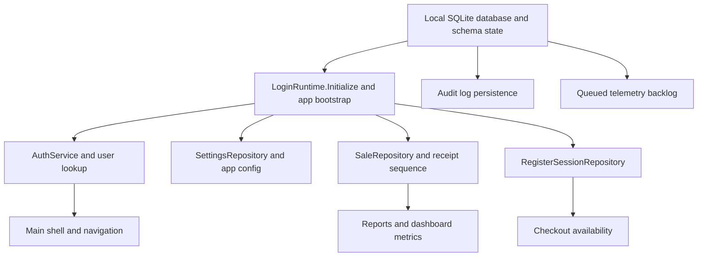

# Security and Reliability Audit of RetailStorePOS-Microsoft

## Security Source Audit

This audit started with the enabled GitHub connector and focused on the repository the user specified, `AbduarhmAN/RetailStorePOS-Microsoft`. I inspected the local authentication flow, user and permission model, register-open/close and cash-adjustment paths, checkout and sale persistence, settings and local storage, audit logging, telemetry, DB bootstrap/migrations, and readiness/self-test code. For external reference points, I used primary or high-authority guidance from NIST, CISA, and OWASP on rate limiting, default credentials, authentication error handling, password storage, session handling, and security logging. fileciteturn55file0 fileciteturn55file1 fileciteturn56file0 fileciteturn57file0 fileciteturn58file0 fileciteturn59file0 fileciteturn59file2 fileciteturn61file0 fileciteturn63file0 fileciteturn63file1 fileciteturn65file2 fileciteturn65file3 citeturn0search1turn0search2turn0search3turn1search0turn1search1turn2search0turn2search8turn2search9

The codebase already contains several good defensive patterns. The inspected repositories use parameterized SQLite commands rather than string-concatenated SQL in their main data paths; sale creation and register opening use transactions; the SQLite connection factory enables foreign keys and WAL mode; database bootstrap validates integrity during maintenance migrations; the DB path is forced to remain local rather than a network UNC path; remote Supabase credentials are stored with Windows DPAPI; and telemetry is intentionally designed as optional/queueable so offline workflows are not supposed to depend on remote services. Those are meaningful strengths for an offline-first POS. fileciteturn56file0 fileciteturn56file1 fileciteturn57file0 fileciteturn58file0 fileciteturn61file0 fileciteturn63file0 fileciteturn63file1 fileciteturn63file2 fileciteturn65file2

The access-control story is mixed. The UI shell does enforce some useful permission gating: `SettingsPage` shows or hides navigation entries based on `Auth.Can*` flags and falls back to the first visible route when a requested tag is not visible; `UsersPageViewModel` blocks create/save/deactivate actions unless the current user can manage users; and `CheckoutPage` checks `CanOverridePrice` before showing the price-override flyout. That said, the deeper service/repository layer largely does not carry actor context or permission checks, so much of the present protection is shell-level rather than defense-in-depth. fileciteturn59file2 fileciteturn59file0 fileciteturn58file2 fileciteturn55file0 fileciteturn56file0 fileciteturn57file1 fileciteturn61file0

The table below summarizes the key source areas reviewed and what they established.

| Area inspected | Key files or modules | What was verified | Status |
|---|---|---|---|
| Auth bootstrap and login | `LoginRuntime`, `AuthService`, `LoginWindowViewModel`, `LoginPage.xaml.cs`, `LoginPage.xaml` | Hard-coded first-run admin creation, password/PIN login behavior, surfaced error messages, onboarding/default-credential hints | Confirmed in source. fileciteturn55file1 fileciteturn55file0 fileciteturn62file0 fileciteturn65file0 fileciteturn62file1 |
| User model and permissions | `User`, `UserRepository`, `UsersPageViewModel` | Current modeled permissions, missing modeled permission for register close despite schema column, admin-only user management in UI | Confirmed in source. fileciteturn55file2 fileciteturn56file0 fileciteturn59file0 fileciteturn57file0 |
| Shell navigation and route gating | `MainWindow.xaml.cs`, `SettingsPage.xaml.cs` | Hidden-route fallback and permitted-page navigation logic | Confirmed in source. fileciteturn65file1 fileciteturn59file2 |
| Checkout, sales, price override | `CheckoutViewModel`, `CheckoutPage.xaml.cs`, `SaleRepository` | Sale creation, price override gate, runtime schema mutation in sale/report paths | Confirmed in source. fileciteturn58file1 fileciteturn58file2 fileciteturn58file0 |
| Register lifecycle | `RegisterSessionRepository`, `MainWindow.xaml.cs`, register-session contract and threat model spec | Register open/close/cash adjustment flow, lack of close/cash-adjust role check, intended offline-critical ownership | Confirmed in source. fileciteturn61file0 fileciteturn65file1 fileciteturn61file2 fileciteturn61file1 |
| Audit logging | `AuditLogRepository`, `AuditLogService` | Logged event types exist, but audit writes can fail silently | Confirmed in source. fileciteturn56file1 fileciteturn56file2 |
| Local DB/bootstrap and resilience | `DatabaseInitializer`, `SqliteConnectionFactory`, `DatabasePaths`, `ReadinessService` | Foreign keys/WAL, local-only DB path, migration integrity checks, readiness verification of bootstrap/auth/catalog/tax/checkout | Confirmed in source. fileciteturn57file0 fileciteturn63file1 fileciteturn63file2 fileciteturn65file3 |
| Telemetry and secret handling | `TelemetryService`, `SecureStorageService` | DPAPI for remote secrets, optional queueable telemetry, remote transmission of full exception strings | Confirmed in source. fileciteturn63file0 fileciteturn65file2 |
| Cloud-side authz, payment gateway processing, signed auto-update enforcement | No clearly inspected server/backend repo in scope | These surfaces were not verifiable from the inspected repo snapshot | Requires source confirmation. |

## Unauthorized Access and Privilege Risk Analysis

The strongest current access-control controls are at the shell and view-model layer, not at the state-changing repository layer. That means normal navigation for ordinary users is somewhat constrained, but the architecture is still too trusting of “already in the app” local session state for a retail environment that includes shared terminals, cash handling, user administration, and settings changes. fileciteturn59file2 fileciteturn59file0 fileciteturn58file2 fileciteturn56file0 fileciteturn61file0

Under **Spoofing**, the biggest confirmed issue is the first-run bootstrap path: the app hard-codes `admin / 1234` and also seeds PIN `1234`, then displays the default admin hint in the UI. That transforms the initial administrator account into a predictable credential set until the merchant changes it. CISA explicitly recommends eliminating default passwords, and OWASP treats hard-coded/default credentials as a serious authentication weakness because attackers can simply use known credentials to gain privileged access. fileciteturn55file1 fileciteturn65file0 fileciteturn62file1 citeturn2search0turn2search1turn2search8turn2search9

Also under **Spoofing**, the login flow has no visible retry throttling, no exponential backoff, no lockout, and no device-level delay for either password or PIN attempts. The cashier PIN is four digits in the current UI and validation path. NIST guidance requires rate limiting for memorized secrets and also requires retry limiting for activation secrets such as PINs; the current code does not show that control. fileciteturn55file0 fileciteturn62file0 fileciteturn62file1 citeturn0search1turn0search2

Under **Elevation of Privilege** and **Tampering**, the clearest current gap is the register-close and cash-adjustment path. The database schema includes a `can_close_day` column, but the `User` model does not expose it, `UserRepository` does not read or write it, `AuthService` does not enforce it, and `MainWindow` enables cash-in/out and close-register actions based only on whether an active register session exists. In practice, on the inspected code path, any signed-in user who reaches the shell with an active session can perform cash adjustments or close the register. The repository’s own feature threat model already flags the product-policy question of whether “any signed-in user can close session” is acceptable; the current implementation does not impose a separate permission boundary. fileciteturn57file0 fileciteturn55file2 fileciteturn56file0 fileciteturn65file1 fileciteturn61file0 fileciteturn61file1

Under **Repudiation**, important security-significant events are logged, but `AuditLogService.Log()` catches and suppresses all exceptions. That is good for uptime, but bad for trustworthiness of the audit trail: if the audit table is unavailable, full, or corrupted, the system may continue without any durable record of login failures, user changes, sales, or register actions. OWASP’s logging guidance supports keeping the application running when logging fails, but it also emphasizes that authentication, authorization, session, high-risk admin, and sequencing events should be logged and monitored rather than disappearing silently. fileciteturn56file2 fileciteturn56file1 citeturn1search0

Under **Information Disclosure**, the main concern is not payment-card storage—the inspected schema does not show cardholder-data storage paths in scope—but local business data and diagnostic detail. The app is explicitly local-first, the SQLite file is local, and I found no application-layer encryption for `pos.db`. Remote secrets are protected with DPAPI, which is good, but telemetry error events can include `error.ToString()` in remote payloads, which may expose paths, SQL details, or other environment-sensitive text if telemetry is configured. fileciteturn63file0 fileciteturn63file1 fileciteturn63file2 fileciteturn65file2

Under **Denial of Service** and **Availability**, the most consequential weakness is architectural rather than adversarial: the local database/bootstrap path is a single dependency for startup, auth, checkout, settings, reporting, and audit; and `SaleRepository` still performs runtime `ALTER TABLE` work in critical create/read/report paths. If that path fails because of DB lock, corruption, or migration inconsistency, core retail workflows can fail at runtime rather than only during controlled maintenance. fileciteturn57file0 fileciteturn58file0 fileciteturn63file1 fileciteturn65file1

## Vulnerability Register

| Vulnerability name | STRIDE | Affected file or module | Attack scenario | Impact | Likelihood | Severity | Recommended fix | Evidence |
|---|---|---|---|---|---|---|---|---|
| Hard-coded bootstrap administrator credentials and UI disclosure | Spoofing / Elevation of Privilege | `LoginRuntime`, `LoginPage.xaml.cs`, `LoginPage.xaml` | A local insider or anyone with terminal access signs in using predictable first-run admin credentials before they are changed | Full admin access to users, settings, reports, product management, and price override | High on first deployment; medium afterward if unchanged | **Critical** | Replace static bootstrap credentials with a mandatory secure first-run enrollment flow or one-time random setup secret; force credential change before broader navigation | fileciteturn55file1 fileciteturn65file0 fileciteturn62file1 citeturn2search0turn2search1turn2search8turn2search9 |
| No brute-force throttling or retry limiting for password/PIN login | Spoofing | `AuthService`, `LoginWindowViewModel`, login UI | A cashier or attacker repeatedly tries 4-digit PINs or admin passwords on a shared terminal | Unauthorized sign-in, especially against weak/default credentials | High in shared-terminal retail use | **High** | Add per-user and per-device retry limiting, exponential backoff, and operator-visible lockout or cooling-off states; migrate cashier PINs toward 6 digits | fileciteturn55file0 fileciteturn62file0 fileciteturn62file1 citeturn0search1turn0search2 |
| Register close and cash-adjustment permission is not enforced | Elevation of Privilege / Tampering | `MainWindow.xaml.cs`, `RegisterSessionRepository`, users schema/model mismatch | A non-admin cashier closes the active register or performs cash-out/cash-in without a distinct permission grant | Cash-drawer integrity loss, shift disruption, misleading end-of-day figures, forced logout of legitimate operator | Medium to high | **High** | Model and enforce `can_close_day` and a distinct cash-adjust permission end to end; deny by default in UI and service layer; audit allow/deny events | fileciteturn57file0 fileciteturn55file2 fileciteturn56file0 fileciteturn65file1 fileciteturn61file0 fileciteturn61file1 |
| Authorization is mostly UI-gated, not service-boundary enforced | Elevation of Privilege | `UserRepository`, `SettingsRepository`, `SaleRepository`, `RegisterSessionRepository` | A future page, debug/test harness, plugin, or accidental internal call writes sensitive state without re-checking permissions | Defense-in-depth failure; future bypasses become easier | Medium | **Medium-High** | Introduce a central authorization service and permission-checked command layer for sensitive writes | fileciteturn56file0 fileciteturn57file1 fileciteturn58file0 fileciteturn61file0 fileciteturn59file2 fileciteturn59file0 |
| Username enumeration in admin password flow | Information Disclosure / Spoofing | `AuthService`, `LoginWindowViewModel` | An attacker learns whether a username exists because password flow returns “User not found” versus “Invalid password” | Easier targeted guessing and credential attacks | Medium | **Medium** | Return a generic invalid-credentials message for all auth failures and keep the detailed reason only in audit logs | fileciteturn55file0 fileciteturn62file0 citeturn1search1 |
| Password login accepts a PIN as a fallback when no password is stored | Spoofing | `AuthService`, `UsersPageViewModel` | An admin account created without a password is authenticated through the password box using a short PIN | Lower-than-expected admin assurance and confusing credential policy | Medium | **Medium** | Require a real password for all admin accounts; keep PIN only for cashier quick login or lock-screen unlock | fileciteturn55file0 fileciteturn59file0 |
| Silent audit-log failure | Repudiation | `AuditLogService`, `AuditLogRepository` | Audit writes fail because the DB is full, locked, or damaged, but the application does not visibly signal the failure | Missing evidence for login, user changes, register close, and cash movement | Medium | **Medium** | Add a fallback local event sink, health alerts, and operator/admin warnings when audit writes fail | fileciteturn56file2 fileciteturn56file1 citeturn1search0 |
| Weak credential-storage posture for legacy or stolen local DBs | Information Disclosure | `UserRepository` | An attacker obtains local `pos.db` and performs offline cracking; legacy SHA-256 hashes are accepted, and PBKDF2 work factor is low by current OWASP guidance | Account compromise after device or file theft | Medium | **Medium** | Raise the PBKDF2 work factor substantially and rehash on successful login or password change; retire legacy SHA-256 fallback after migration window | fileciteturn56file0 citeturn0search3 |
| Remote telemetry can send full exception strings | Information Disclosure | `TelemetryService` | Stack traces or verbose exception text containing local paths or implementation detail are sent remotely when telemetry is configured | Overexposure of internal diagnostics | Medium | **Medium** | Separate local full diagnostics from remote redacted summaries; scrub file paths, usernames, DB paths, and raw exception bodies before upload | fileciteturn65file2 |
| No verified idle auto-lock or durable session lifecycle enforcement | Spoofing / Elevation of Privilege | `AuthService`, users/session schema | An operator leaves a logged-in POS unlocked and the next person uses the active session | Unauthorized use through session piggybacking on shared devices | Medium | **Medium** | Implement idle lock and explicit unlock flow; persist session creation/lock/unlock/logout events; invalidate session state robustly on logout | fileciteturn55file0 fileciteturn57file0 citeturn0search2 |

## Access Control Improvement Plan

The safest path forward is to preserve the existing local/offline architecture and add a real authorization layer rather than redesigning the entire app. The current shell already knows which features should be visible, but the same rules need to be enforced again at state-changing entry points. That means **deny by default**, then allow only when both the session and the permission are valid. fileciteturn59file2 fileciteturn59file0 fileciteturn58file2

A practical permission model for this codebase would keep the existing flags and add the missing cash-handling controls. At minimum, I would formalize: `Checkout`, `ManageProducts`, `ManageSettings`, `ManageUsers`, `ViewReports`, `OverridePrice`, `CashAdjustRegister`, and `CloseRegister`. The schema already hints at this direction with `can_close_day`; the current gap is that the field is not modeled or enforced. Because that field already exists in the table definition, extending the user model and repository is lower-risk than inventing a completely new RBAC framework. fileciteturn57file0 fileciteturn55file2 fileciteturn56file0

The enforcement plan should be layered:

| Sensitive feature | Current state | Required control | Fail-safe behavior |
|---|---|---|---|
| Login | Password/PIN auth exists, but no throttling or generic errors | Retry limiting, generic failure message, forced secure first-run admin creation | Deny sign-in and back off after repeated failures |
| User management | UI checks admin, but “unlock” is not step-up auth | Maintain admin-only gate; optionally require re-auth for privilege changes and credential resets | Deny save/deactivate on stale or non-admin session |
| Settings and tax | Shell visibility exists | Re-check permission in saving commands or services, not just in navigation | Deny write and log attempted access |
| Price override | UI button checks `CanOverridePrice` | Keep the UI check and add a service-side permission check before applying final sale state | Deny override and keep original price |
| Register cash in/out and close register | No distinct permission enforced | Add `CashAdjustRegister` and `CloseRegister` permission checks in shell, VM/service, and repo entry point | Deny operation, do not open dialog or change drawer state |
| Reporting/export | Mostly route-gated | Add command-level checks for report generation/export and future advanced reporting actions | Deny access and log authorization failure |

fileciteturn58file2 fileciteturn59file0 fileciteturn59file2 fileciteturn61file0 fileciteturn65file1

For auditing, every security-significant path should record both **successful** and **denied** actions. At a minimum, that means authentication success/failure, privilege changes, user creation/deactivation, settings changes, register open/close, cash in/out, price override, and sequencing failures. OWASP explicitly recommends logging authentication failures, authorization failures, session-management failures, administrative actions, and suspicious business-logic sequencing issues. The app already logs many success/failure events; the missing piece is durable signaling when audit persistence itself breaks. fileciteturn55file0 fileciteturn56file2 fileciteturn65file1 citeturn1search0turn1search4

Finally, session behavior should be hardened with minimal architectural change. The existing `AuthService` already has `Lock()` and `UnlockWithPin()` primitives, so the natural next step is to add inactivity-based lock, visible lock-screen state, and step-up reauthentication for particularly sensitive operations such as changing admin credentials, disabling users, or closing a register when the closer is not the register opener. I did not find confirmed call sites for an idle-lock flow in the inspected code, so the existence of any separate lock UI requires source confirmation. fileciteturn55file0 citeturn0search2

## Single Points of Failure and Failure Hierarchy and Dependency Map

The codebase is structurally a **single-device, single-local-dataset** application. That is a valid product strategy for a desktop POS, but it means the local database/bootstrap path is the dominant shared dependency for nearly every workflow: startup, login, settings, checkout, register state, reporting, telemetry backlog, and audit logging. The code acknowledges that reality in several places, including the readiness service and the local-only database path contract. fileciteturn63file2 fileciteturn63file1 fileciteturn57file0 fileciteturn65file3

The highest-severity failure hierarchy is below.

| Rank | Failing component | What breaks first | Downstream impact | User-facing symptom | Severity |
|---|---|---|---|---|---|
| Highest | Local DB file, connection factory, or migration bootstrap | Startup cannot initialize repositories or schema | Login, checkout, settings, reporting, audit, and telemetry queue all fail together | Splash/startup error or unusable app | **Critical** |
| High | User/auth bootstrap | Sign-in becomes unsafe or impossible, especially if first-run admin creation or user reads fail | No legitimate session; all protected routes unavailable | Login failure or unsafe dependence on defaults | **High** |
| High | Sale persistence and receipt sequencing | Checkout completion fails | No sale saved, no stock decrement, reporting gaps, operator disruption | “Unable to complete the sale right now” | **High** |
| High | Register-session state | Checkout overlay may stay blocked, or close/cash workflows fail | Drawer operations and shift close blocked or inconsistent | Register unavailable, close/cash dialogs fail | **High** |
| Medium-High | Settings table/service | Currency, tax, onboarding, printer and telemetry run-state degrade | UI inconsistency, wrong formatting, inability to save store config | Configuration errors or degraded behavior | **Medium-High** |
| Medium | Audit-log persistence | Core app continues, but forensics and operator accountability degrade | Later investigations become weaker | No immediate visible error unless added | **Medium** |
| Medium | Time-validation loop | Startup may stall until user chooses to continue | Login availability delay | Repeated warning dialog before normal use | **Medium** |
| Lower | Telemetry sync path | Remote analytics/error upload fails | Core POS remains available because telemetry is optional and queued | Usually invisible or minor background issue | **Low** |

fileciteturn57file0 fileciteturn63file1 fileciteturn63file2 fileciteturn58file0 fileciteturn61file0 fileciteturn57file1 fileciteturn56file2 fileciteturn65file1 fileciteturn65file2

One specific reliability risk deserves special attention: `SaleRepository` does runtime schema mutation for `sale_items.item_cost_cents` in sale creation and multiple read/report methods. That means checkout and reporting can fail because of DDL side effects in normal operations rather than only during bootstrap or maintenance. This is the wrong place to carry schema evolution risk for a cash-register workflow. fileciteturn58file0

There are also a few positive reliability findings. The database initializer uses transaction-scoped migrations and integrity checks; the app uses WAL mode and foreign keys; telemetry is intentionally non-critical; and the readiness service already exercises bootstrap, local DB read/write, auth initialization, catalog lookup, tax, and checkout initialization. Printing also appears designed to degrade more gracefully than checkout, because the receipt print path falls back from native print to PDF/shell behavior rather than blocking sale completion itself. fileciteturn57file0 fileciteturn63file1 fileciteturn65file2 fileciteturn65file3 fileciteturn58file2

## Prevention and Hardening Strategy

The hardening strategy should start with **credential hygiene**, because that is where unauthorized-access risk is most immediate. Remove static bootstrap credentials completely, require deliberate first-run admin enrollment, and add rate limiting for both password and PIN sign-in. If the business must keep PIN-based cashier access for speed, the app should still impose retry limits and ideally migrate toward six-digit PINs for new stores or new users. NIST and CISA support those moves directly, and they are compatible with the current app’s local/offline design. fileciteturn55file1 fileciteturn55file0 fileciteturn62file1 citeturn0search1turn0search2turn2search8turn2search9

The second priority is **cash-handling authorization**. In a POS, cash-adjustment and register-close operations should never depend solely on “is someone signed in and is there an active session?” Add explicit permissions, enforce them in `MainWindow` before dialog launch, enforce them again in the command/service path, and record both approved and denied attempts. The existing schema and register contract suggest this can be done incrementally rather than through a disruptive redesign. fileciteturn57file0 fileciteturn61file2 fileciteturn65file1 fileciteturn61file0

The third priority is **service-boundary authorization and session safety**. Keep the existing UI navigation gating, but move sensitive state changes behind permission-checked command handlers. Add idle lock for shared terminals, and consider step-up reauthentication for user-administration changes, register close, and future destructive operations such as migrations or resets. NIST’s session guidance is consistent with invalidating session state on logout and treating session secrets as meaningful continuity controls rather than just UI state. fileciteturn59file2 fileciteturn55file0 citeturn0search2

The fourth priority is **audit and recovery durability**. Keep the current “logging failure should not crash the app” behavior, but do not let failures vanish silently. At minimum, write a fallback local log, set a visible health flag, and add a simple admin-facing diagnostics panel showing whether audit persistence is healthy. OWASP’s logging guidance strongly supports consistent application logging for auth, admin actions, state changes, and suspicious flow deviation, while also warning that logging failures must be tested and handled safely. fileciteturn56file2 fileciteturn56file1 citeturn1search0

The fifth priority is **credential-hash modernization and local-data hardening**. The repo already salts PBKDF2 hashes, which is better than unsalted legacy hashing, but the inspected iteration count is low by current OWASP guidance and legacy SHA-256 verification is still accepted. Upgrade-on-login or upgrade-on-password-change is the lowest-risk migration path. Because the app is local-first and stores the business DB locally, OS-level controls such as separate Windows accounts, BitLocker, standard-user operation instead of shared admin sessions, and disciplined backup/restore practices should be treated as part of the product’s operational security model, even if app-layer DB encryption is deferred. fileciteturn56file0 fileciteturn63file1 fileciteturn63file2 citeturn0search3

The sixth priority is **availability discipline**. Remove runtime `ALTER TABLE` work from sale/report codepaths and confine schema evolution to startup-safe or maintenance migrations. Keep the readiness service, but use it more aggressively for operator-visible health checks, backup validation, and recovery-mode entry when bootstrap or DB integrity fails. That will lower the chance that a sale or a report becomes the first time the app discovers its schema is unhealthy. fileciteturn58file0 fileciteturn57file0 fileciteturn65file3

## Priority Roadmap

| Rank | Improvement | Security risk reduced | Business impact reduced | Implementation complexity | Recommended order | Evidence |
|---|---|---|---|---|---|---|
| Highest | Replace hard-coded first-run admin credentials with secure enrollment or one-time random bootstrap | Very high | Very high | Medium | Build first | fileciteturn55file1 fileciteturn65file0 fileciteturn62file1 |
| High | Add password/PIN retry limiting, backoff, and stronger PIN policy | Very high | High | Medium | Build second | fileciteturn55file0 fileciteturn62file0 citeturn0search1turn0search2 |
| High | Enforce `CloseRegister` and `CashAdjustRegister` permissions end to end | High | Very high | Medium | Build third | fileciteturn57file0 fileciteturn61file0 fileciteturn65file1 |
| High | Centralize authorization checks for sensitive writes instead of relying mainly on route visibility | High | High | Medium-High | Build fourth | fileciteturn59file2 fileciteturn56file0 fileciteturn57file1 |
| Medium-High | Upgrade password hashing and retire legacy SHA-256 fallback via staged migration | Medium-High | High | Medium | Build fifth | fileciteturn56file0 citeturn0search3 |
| Medium-High | Add idle lock, step-up reauth for sensitive admin/cash actions, and better session lifecycle logging | Medium-High | High | Medium | Build sixth | fileciteturn55file0 citeturn0search2 |
| Medium | Make audit logging durable and visibly unhealthy when it fails | Medium | Medium-High | Low-Medium | Build seventh | fileciteturn56file2 citeturn1search0 |
| Medium | Remove runtime DDL from checkout/reporting paths and confine schema changes to migrations | Medium | High | Medium | Build eighth | fileciteturn58file0 fileciteturn57file0 |
| Medium | Sanitize remote telemetry exception payloads | Medium | Medium | Low-Medium | Build ninth | fileciteturn65file2 |
| Lower but worthwhile | Add explicit recovery mode, backup/restore checks, and operator diagnostics using readiness infrastructure | Lower direct security, high resilience | High | Medium | Build tenth | fileciteturn65file3 fileciteturn57file0 |

The first four roadmap items are the ones most likely to reduce real unauthorized-access and cash-integrity risk quickly without destabilizing the rest of the product. Items five through eight are the highest-value follow-ons for medium-term hardening and operational resilience. fileciteturn55file1 fileciteturn61file0 fileciteturn58file0 fileciteturn56file0

## Final Expert Verdict

The safest practical reading of the current codebase is this: **the application already has a credible local/offline retail foundation, but it is not yet hardened enough for real-world shared-terminal cash operations without additional authorization and credential controls**. The strongest current engineering choices are local-first design, transactional SQLite writes, foreign keys and WAL, migration integrity checks, DPAPI storage for remote secrets, route-level permission gating, and optional telemetry so offline workflows do not depend on the network. Those are good building blocks. fileciteturn57file0 fileciteturn63file0 fileciteturn63file1 fileciteturn59file2 fileciteturn65file2

The most serious present security weakness is **not** an exotic remote exploit. It is a cluster of everyday retail risks: predictable bootstrap credentials, no brute-force resistance for short PINs/passwords, and missing distinct authorization for register-close and cash-adjustment operations. If those stay as-is, a normal employee or casual insider at the terminal is a more realistic threat than an advanced external actor. fileciteturn55file1 fileciteturn55file0 fileciteturn61file0 fileciteturn65file1 citeturn0search1turn2search8turn2search9

The most serious present reliability weakness is that too much of the application depends on one local DB/bootstrap path, while checkout and reporting still carry schema-mutation behavior inside normal business workflows. That is a fixable design issue, and it does **not** require a risky full rewrite. The right move is controlled hardening: secure first-run enrollment, real auth throttling, explicit register permissions, service-boundary authorization, stronger session handling, durable audit behavior, and migration discipline. fileciteturn57file0 fileciteturn58file0 fileciteturn65file3

If the goal is to improve the product without unnecessary redesign, the best next direction is: **keep the current WinUI/offline architecture, but stop trusting UI visibility as the main security boundary**. Harden auth first, harden cash-handling authorization second, move sensitive checks into command/service boundaries third, and then clean up reliability risks in migrations, audit durability, and startup recovery. That sequence delivers the largest risk reduction with the least architectural disruption.