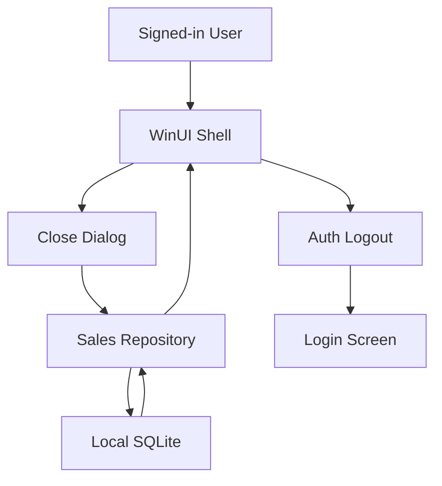

# Assumption Check-In

- Intended usage is a local single-store Windows POS application with local SQLite storage.
- This feature is a local desktop shell/dialog workflow, not an internet-exposed API surface.
- Authentication and logout are handled by local session state in `AuthService`.
- Older databases may exist without any `register_sessions` rows before upgrade.
- Threat ranking is most sensitive to whether "any signed-in user can close session" is an accepted
  product rule and whether local machine users are trusted operators.

Open questions that would materially change ranking:

- Is this workstation single-operator or shared among multiple staff accounts in the same shift?
- Are local database files protected by OS account controls outside the application?

## Executive summary

Top risk themes for this feature are local session-integrity issues, incorrect logout ordering,
and legacy migration mistakes that create false operational state. Highest-risk paths are the
Sales close write, the shell logout transition, and the upgrade behavior for older local
databases with no prior register history.

## Scope and assumptions

In scope:

- `specs/005-close-register-menu/spec.md`
- `RetailStorePOS.Data/Class1.cs`
- `RetailStorePOS.Data/Modules/Sales/RegisterSessionRepository.cs`
- `Nexill.RetailStorePOS/MainWindow.xaml`
- `Nexill.RetailStorePOS/MainWindow.xaml.cs`
- `Nexill.RetailStorePOS/Services/AuthService.cs`
- `Nexill.RetailStorePOS/Views/CheckoutPage.xaml.cs`

Out of scope:

- Supabase/cloud sync
- external network services
- unrelated tax, telemetry, and reporting features

Assumptions:

- Existing merchant databases may predate register-session support.
- The application continues to run offline-first on a local machine.
- Product intent accepts any signed-in user closing the single active session.

## System model

### Primary components

- WinUI shell and dialog layer in `Nexill.RetailStorePOS` drives the profile menu, close dialog,
  and logout transition.
- Sales data layer in `RetailStorePOS.Data` owns register-session reads/writes and migration state.
- Local SQLite database stores business records, register sessions, users, and settings.

### Data flows and trust boundaries

- Signed-in operator -> WinUI shell  
  Data: menu clicks, counted cash, closing note  
  Channel: local UI events  
  Security guarantees: local sign-in required; no network boundary  
  Validation: dialog input validation and confirmation flow

- WinUI shell -> Sales repository  
  Data: active-session query, close-summary query, close command payload  
  Channel: in-process method calls  
  Security guarantees: same-process boundary only; module ownership is the main control  
  Validation: repository checks active session and persistence order

- Sales repository -> SQLite database  
  Data: session rows, sales totals, migration metadata  
  Channel: local SQLite connection  
  Security guarantees: local file access, transactional writes, versioned migrations  
  Validation: schema existence checks, `PRAGMA user_version`, transaction boundaries

#### Diagram

## Assets and security objectives

| Asset | Why it matters | Security objective |
|------|----------------|-------------------|
| Local `register_sessions` state | Determines whether store has an active register and what closing cash is recorded | Integrity |
| Local auth/session state | Controls whether the shell remains signed in or returns to login | Integrity |
| Historical sales data | Feeds expected Cash/Card totals and must not be rewritten during upgrade | Integrity |
| Local merchant database file | Holds all business data and upgrade state | Integrity / Availability |
| Audit/logout trail | Needed to explain who closed a session and when logout occurred | Integrity |

## Attacker model

### Capabilities

- Signed-in local operator can invoke shell actions and provide arbitrary counted-cash and note
  input.
- Local machine user with file access may tamper with the SQLite database outside the app.
- Upgrade path bugs can be triggered by opening an older database on a newer app version.

### Non-capabilities

- No evidence of pre-auth internet attacker reaching this workflow directly.
- No evidence of remote API calls or multi-tenant network boundaries for this feature.

## Entry points and attack surfaces

| Surface | How reached | Trust boundary | Notes | Evidence |
|--------|-------------|----------------|-------|----------|
| Profile menu action | Signed-in shell interaction | User -> WinUI shell | Starts close flow | `specs/005-close-register-menu/spec.md`, `Nexill.RetailStorePOS/MainWindow.xaml` |
| Close dialog confirm | Local modal submit | User -> dialog -> Sales repo | Integrity-sensitive state change | `specs/005-close-register-menu/spec.md`, `Nexill.RetailStorePOS/MainWindow.xaml.cs` |
| Logout transition | Post-close shell event | WinUI shell -> Auth state | Must happen only after successful save | `Nexill.RetailStorePOS/Services/AuthService.cs`, `Nexill.RetailStorePOS/MainWindow.xaml.cs` |
| Legacy DB upgrade | App startup / DB initialize | App -> SQLite file | Can corrupt assumptions if migration invents state | `RetailStorePOS.Data/Class1.cs` |
| Open-session lookup | Checkout/open workflow | UI -> Sales repo | Zero-row legacy DB must mean no active session | `RetailStorePOS.Data/Modules/Sales/RegisterSessionRepository.cs`, `Nexill.RetailStorePOS/Views/CheckoutPage.xaml.cs` |

## Top abuse paths

1. Operator submits close action -> save fails -> UI logs out anyway -> store loses visible session state.
2. Upgrade opens old DB -> code backfills fake session -> close totals become misleading.
3. Signed-in low-privilege user closes active session -> shift integrity disrupted by accepted product rule.
4. Local DB tampering alters `closed_at` or opening amounts -> close summary becomes inaccurate.
5. Cancel path preserves stale typed values invisibly -> later close records unintended cash/count note.

## Threat model table

| Threat ID | Threat source | Prerequisites | Threat action | Impact | Impacted assets | Existing controls (evidence) | Gaps | Recommended mitigations | Detection ideas | Likelihood | Impact severity | Priority |
|-----------|---------------|---------------|---------------|--------|-----------------|------------------------------|------|-------------------------|-----------------|------------|-----------------|----------|
| TM-001 | Signed-in local operator | User is signed in and can reach the profile menu | Closes active session even if not original opener | Operational integrity loss for shift handoff | `register_sessions`, audit trail | Product rule explicitly allows any signed-in user to close session; local auth exists in `AuthService.cs` | No stronger authZ boundary for close action | Keep explicit confirmation, visible user identity, and audit logging of close actor; document accepted tradeoff | Log close actor, session id, timestamp, and result | medium | medium | medium |
| TM-002 | Workflow/logic bug | User confirms close and persistence errors occur | UI logs out before save succeeds or closes dialog without retry | Session remains open while operator is logged out | auth state, session state | Clarified spec requires error + retry with user still signed in | Implementation not yet present | Enforce save-then-logout ordering and retry-safe dialog state | Log close failure and logout transition ordering | medium | high | high |
| TM-003 | Migration bug | Older DB exists without register-session rows | App invents synthetic history or partial session state during upgrade | False balances and broken operational history | merchant DB, historical sales, session state | Versioned migration framework in `Class1.cs`; constitution now forbids synthetic backfill | Feature implementation still must honor that rule | Keep migration additive only; never infer sessions from historical sales | Log migration version applied and outcome | medium | high | high |
| TM-004 | Local DB tampering | Attacker has OS-level file access | Edits `register_sessions` or `sales` rows outside app | Inaccurate close totals or false closed/open state | SQLite file, sales totals | Local file only; no remote exposure | App cannot fully trust out-of-process file edits | Rely on OS file protections, validate impossible states, and surface obvious inconsistencies instead of guessing | Log impossible session states and query anomalies | low | high | medium |
| TM-005 | UI state bug | User opens dialog then cancels/dismisses | Stale draft values survive and later get submitted unintentionally | Wrong counted cash or note recorded | session close payload | Clarified spec says cancel discards unsaved values | Implementation not yet present | Reset transient dialog state on every open/cancel | Log dialog open/cancel/confirm transitions during debug telemetry if available | medium | medium | medium |

## Criticality calibration

For this repo and feature:

- **critical**: local workflow bug that can corrupt merchant data broadly or prevent store operation across sessions.
- **high**: state-ordering or migration bug that creates false open/closed session state or wrong close totals.
- **medium**: accepted-product-rule integrity risk or UI-state bug with real but recoverable operational harm.
- **low**: issues needing OS-level file compromise or unlikely operator behavior with limited blast radius.

Examples:

- **high**: logout before successful close save, synthetic session backfill on legacy DB upgrade
- **medium**: any signed-in user closes session, stale dialog draft survives cancel
- **low**: local SQLite tampering by already-compromised workstation account

## Focus paths for security review

| Path | Why it matters | Related Threat IDs |
|------|----------------|--------------------|
| `RetailStorePOS.Data/Class1.cs` | Controls additive migration and legacy DB behavior | TM-003 |
| `RetailStorePOS.Data/Modules/Sales/RegisterSessionRepository.cs` | Owns active-session lookup, summary query, and close persistence | TM-002, TM-004 |
| `Nexill.RetailStorePOS/MainWindow.xaml.cs` | Coordinates dialog launch, retry flow, and logout ordering | TM-002, TM-005 |
| `Nexill.RetailStorePOS/Services/AuthService.cs` | Owns logout side effects and login-state transitions | TM-002 |
| `Nexill.RetailStorePOS/Views/CheckoutPage.xaml.cs` | Existing zero-session gate shows how legacy no-session state reaches real open flow | TM-003 |

## Notes on use

- Runtime workflow is materially different from dev/build tooling; this model covers runtime only.
- If deployment assumptions change toward remote sync or multi-terminal operation, re-rank TM-001
  through TM-004.
